# Parte 1. Ordenando Datos

## Objetivo de la práctica:
Al finalizar la práctica, serás capaz de:
- Aprender a utilizar las funciones de ordenamiento en Excel para organizar datos de manera efectiva en múltiples niveles, permitiendo una mejor visualización y análisis de la información. 
- Al finalizar esta práctica, serás capaz de ordenar listas de empleados por diferentes criterios, como apellido, departamento y extensión, utilizando tanto opciones de ordenación simples como personalizadas.

## Duración aproximada:
- 10 minutos.

## Instrucciones 

### Escenario: 
Eres un generalista de recursos humanos en Develtech Industries y tu gerente te ha pedido que organices la lista de empleados. Quieres buscar rápidamente a los empleados de varias maneras ordenando los datos. La lista de empleados contiene datos que te permitirán ordenar por nombre, fecha, departamento y ubicación de la oficina.

### Tarea 1. Ordenar la lista de empleados por Apellido.

Paso 1. Abre el archivo :
[Develetech Lists](<Develetech Lists.xlsx>) 
y verifica que la hora de trabajo Emplyees esté seleccionada. 

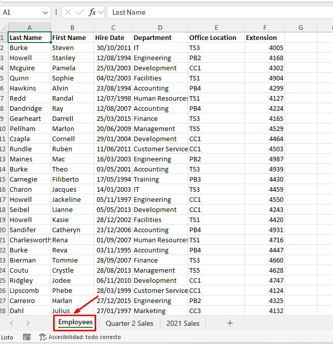

### Resultado esperado
En esta sección se debe mostrar el resultado esperado de nuestro laboratorio

Paso 2. Verifica que la celda A1 esté seleccionada y selecciona _Datos -> Ordenar de A a Z_. Confirma que la lista de empleados esté ordenada por Apellido.

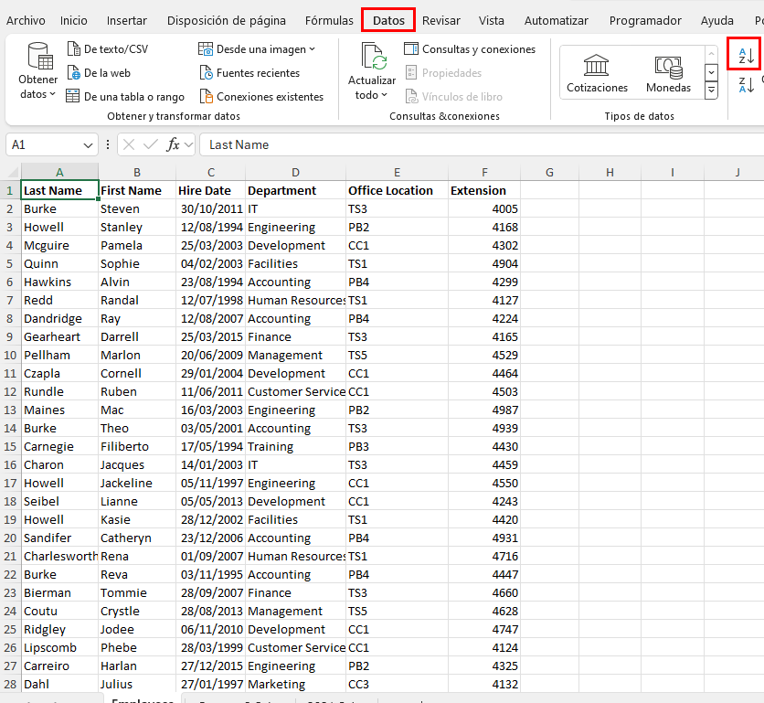

### Tarea 2. Ordenar la lista de empleados por Departamento.

Paso 1. Selecciona la celda D1 y selecciona Datos -> Ordenar.
Observa que Excel mantuvo la ordenación previa por Apellido.

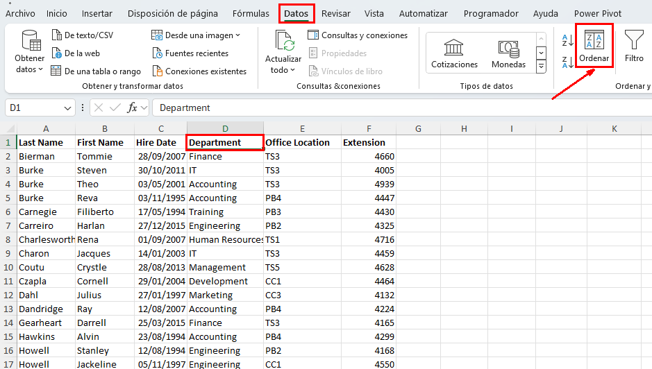

Paso 2. Selecciona la flecha desplegable de Ordenar por y selecciona _Departamento._

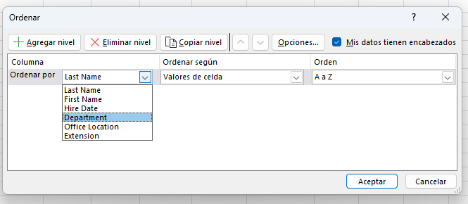

Paso 3. Selecciona Aceptar para ver la lista de empleados.
Verifica que la lista de empleados esté ordenada por Departamento.

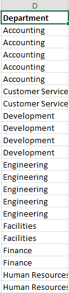

 
 ### Tarea 3. Ordenar la lista de empleados por Apellido, luego por Departamento y luego por Extensión.

 Paso 1. Selecciona __Datos -> Ordenar._

 Paso 2. Selecciona la flecha desplegable de _Ordenar por_ y selecciona _Apellido._

Paso 3. Selecciona _Agregar Nivel._

Paso 4. Selecciona la flecha desplegable de _Luego por_ y selecciona __Departamento._

Paso 5. Selecciona _Agregar Nivel_ de nuevo.

Paso 6. Selecciona la última flecha desplegable de _Luego por_ y selecciona _Extensión._

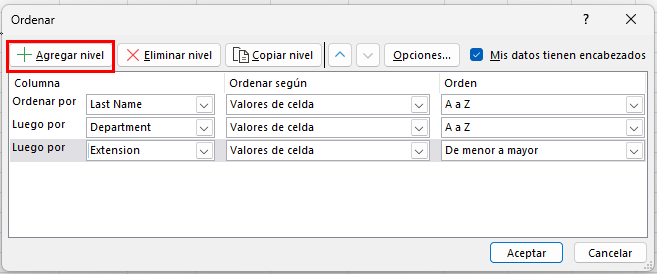

Paso 7. Selecciona Aceptar para ordenar la lista de empleados por Apellido, luego por Departamento, y luego por Extensión.
Confirma que la lista de empleados ha sido ordenada por Apellido, luego por Departamento, y luego por Extensión.

Paso 8. Salva los cambios realizados en el libro y manten abierto el archivo.

### Resultado esperado
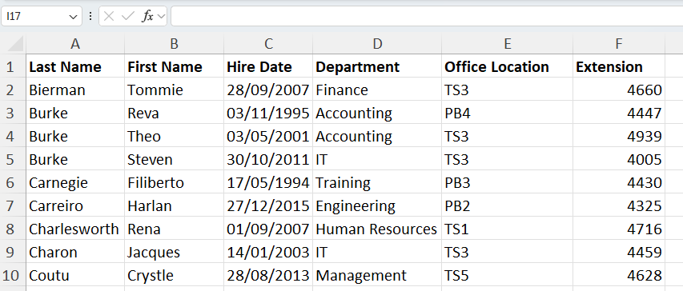

# Parte 2. Filtrando Datos

## Objetivo de la práctica:
Al finalizar la práctica, serás capaz de:
- aplicar filtros complejos, como seleccionar datos que pertenezcan a más de un grupo o categoría, utilizando operadores lógicos como "O" para combinar criterios en diferentes filas de la tabla de datos.
## Duración aproximada:
- 15 minutos.

## Instrucciones 

### Antes de comenzar

El archivo My Develtech Lists.xlsx está abierto.

### Escenario: 
Como generalista de recursos humanos en Develtech Industries, se te pidió que ordenaras la lista de empleados. Ahora se te pide que determines qué empleados están en oficinas y departamentos específicos. Para encontrar esta información, filtrarás la lista de empleados.

 ### Tarea 1. Filtra los datos para todos los empleados en la Ubicación de Oficina PB4.

Paso 1. Selecciona la celda *A1* y selecciona __Datos → Filtro._

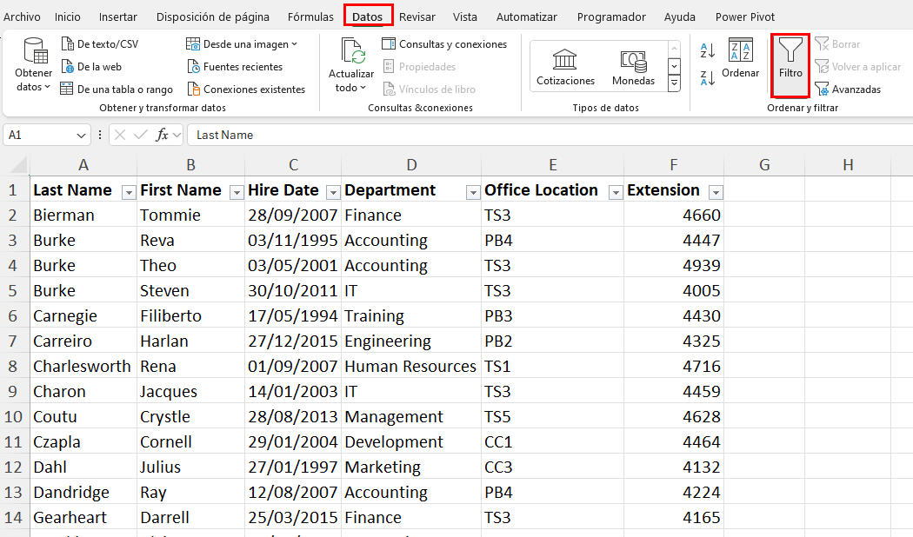

Paso 2. Selecciona la flecha desplegable del __AutoFiltro_ de Ubicación de Oficina y desmarca Seleccionar todo.

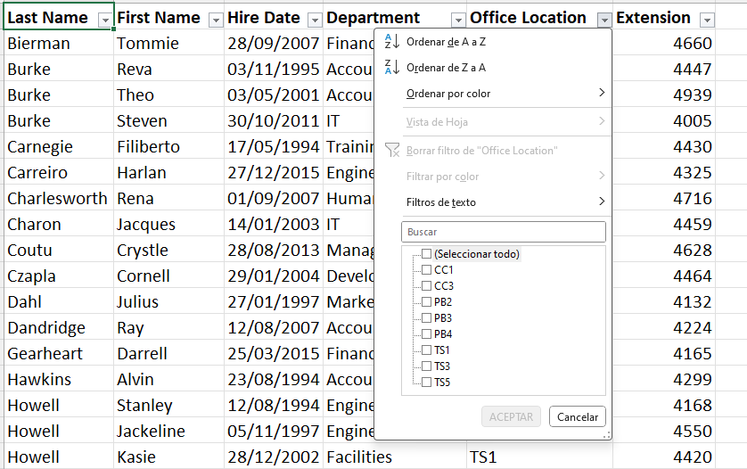

Paso 3. Selecciona PB4 y luego selecciona Aceptar.

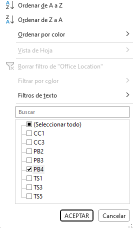

Verifica que solo se muestre la ubicación de oficina PB4.

### Tarea 2.Filtrar empleados de los departamentos de Management (Gestión) y Marketing.

Paso 1. Selecciona la flecha desplegable del AutoFiltro de Ubicación de Oficina y selecciona Borrar Filtro de "Ubicación de Oficina".

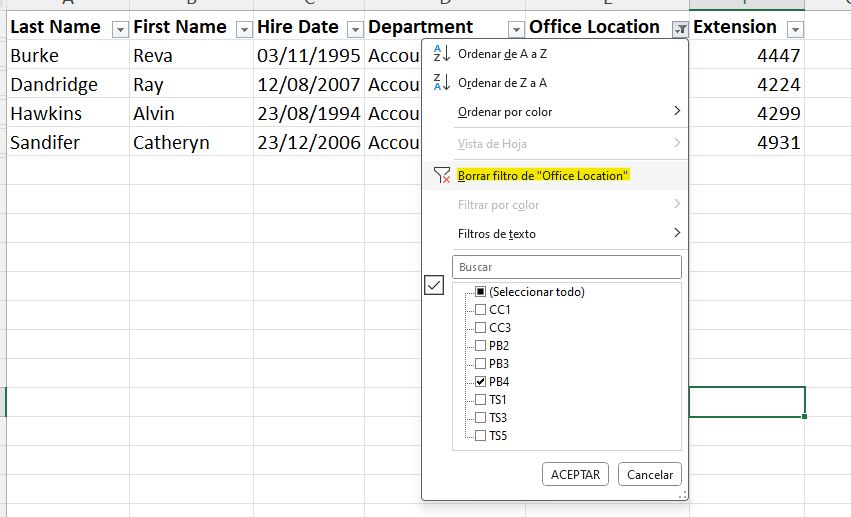

Paso 2.  Selecciona la flecha desplegable del AutoFiltro de Departamento y desmarca Seleccionar todo.

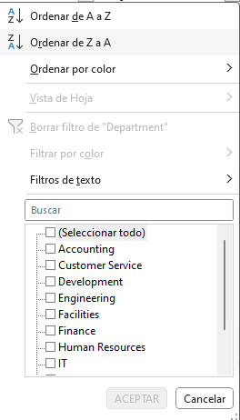

Paso 3. Selecciona Management y Marketing y luego selecciona Aceptar.

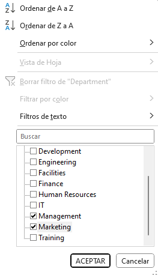

Verifica que solo se muestren los departamentos de Management (Gestión) y Marketing.

### Tarea 3.Crea un filtro personalizado para empleados que estén en los departamentos de Ingeniería o Instalaciones.

 Paso 1. Selecciona la flecha desplegable del AutoFiltro de Departamento y selecciona Borrar Filtro de "Departamento".

Paso 2. Selecciona nuevamente la flecha desplegable del AutoFiltro de Departamento y selecciona Filtros de Texto → Filtro Personalizado.

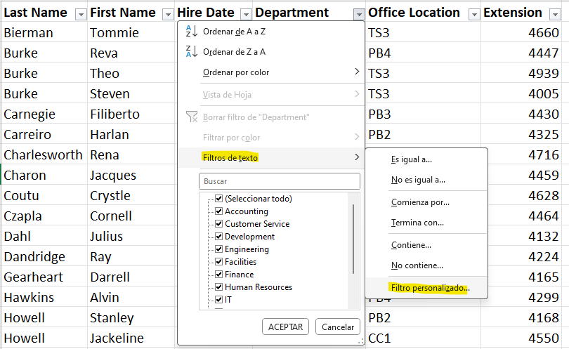

Paso 3.  Selecciona la flecha desplegable de Campos de Parámetro en la primera fila y selecciona Ingeniería.

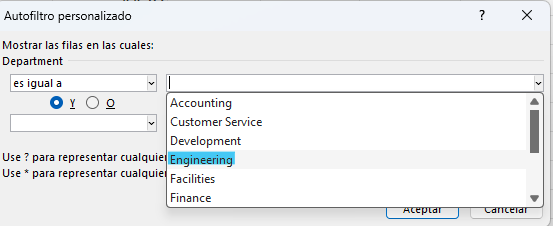

Paso 4. Selecciona el botón de opción O.

Paso 5. Selecciona la flecha desplegable de Selección de Filtro en la segunda fila y selecciona igual.
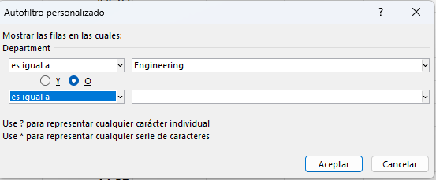

Paso 6. Selecciona la flecha desplegable de Campos de Parámetro en la segunda fila y selecciona Instalaciones.
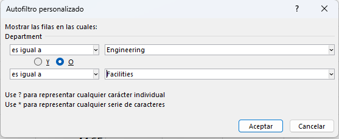

Paso 7. Selecciona Aceptar para filtrar la lista de empleados.
Verifica que la lista de empleados se haya filtrado para los departamentos de Ingeniería e Instalaciones.
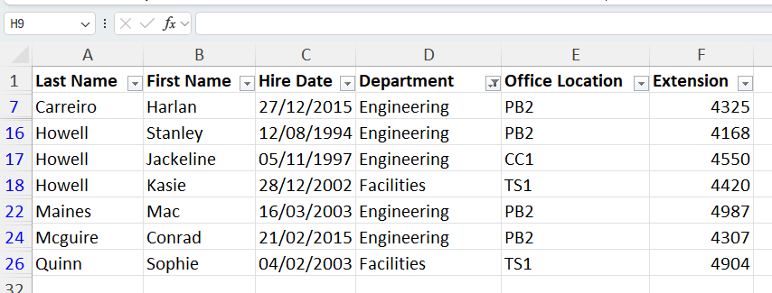

Paso 8. Guarda los cambios en el libro y mantenlo abierto. 

### Tarea 4. Crea un filtro avanzado

Paso. 1 Borra el filtro anterior que se tenía en por departamento

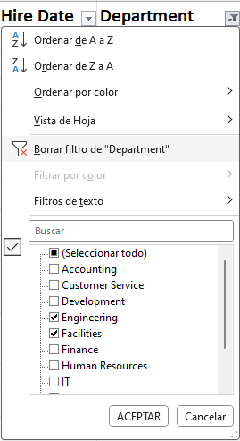

Paso 2. Inserta 4 filas nuevas en la parte superior de los datos, copia y pega los encabezados de los datos de la Celda *A1 a F1*.

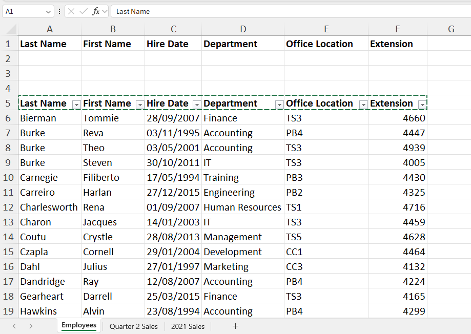

Paso 3. Vas a filtrar los datos de tal manera que no aparezca el Departamento de Marketing y que la localización de la oficina empiece con *T*

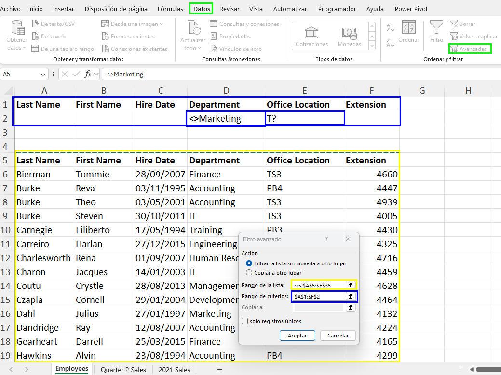

### Resultado esperado

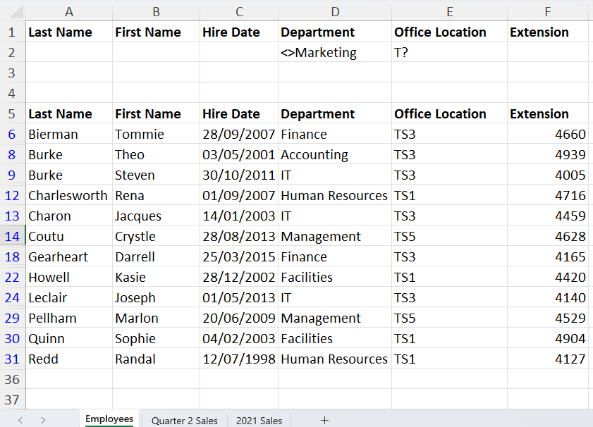

# Parte 3. Usando funciones de Bases de Datos 

## Objetivo de la práctica:
Al finalizar la práctica, serás capaz de:
- Aplicar funciones de base de datos en Excel para calcular sumas y promedios en conjuntos de datos específicos según criterios predefinidos.

- Modificar y ajustar criterios de búsqueda para analizar datos específicos, como ventas totales y promedio para un período determinado.

- Desarrollar habilidades en la manipulación de rangos con nombre y en la utilización de funciones avanzadas para análisis de datos en hojas de cálculo.

## Duración aproximada:
- 15 minutos.

## Instrucciones 

### Antes de comenzar 
Asegurate de tener el archivo __My Devletech  List_ abierto.

### Escenario: 

Como gerente de ventas en Devletech Industries, deseas analizar las cifras de ventas del segundo trimestre para identificar el impacto de las ventas en varias regiones del país. Quieres saber las ventas totales y las ventas promedio en el trimestre donde las ventas en el noreste y sureste fueron menores a $10,000. Además, calcular las ventas totales y promedio del mes de mayo te ayudará en tu análisis de ventas a nivel nacional. Decides utilizar funciones de base de datos para calcular los totales y promedios utilizando el nombre de rango Q2Sales para simplificar la fórmula.

### Tarea 1. Calcula las ventas totales y promedio en el noreste y sureste donde las ventas fueron menores a $10,000.

Paso 1. Selecciona la hoja de cálculo Quarter 2 Sales.

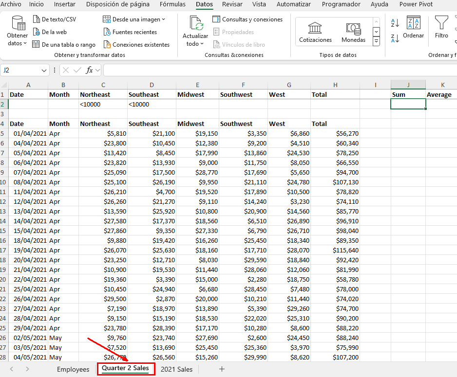

Paso 2. Verifica que la celda J2 esté seleccionada y escribe _=BDSUMA(_

Paso 3. Desde la barra de fórmulas, selecciona Insertar Función.

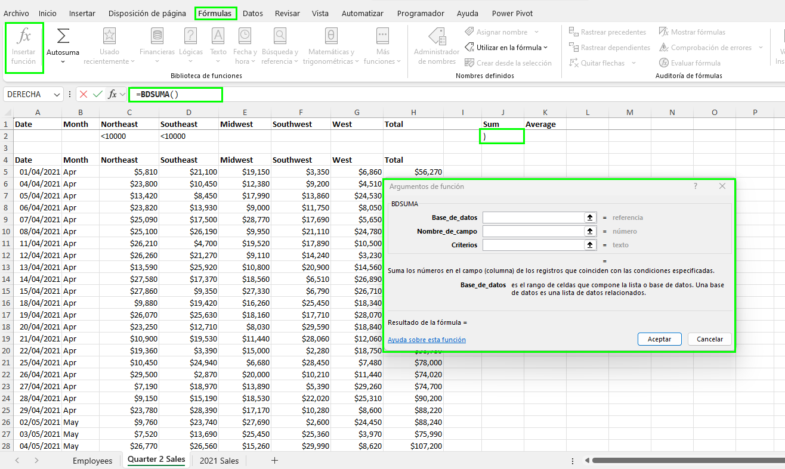

Paso 4.  En el cuadro de diálogo de Argumentos de Función, en el cuadro de texto __Base de Datos_, selecciona __Fórmulas -> Utulizar en la Fórmula -> Q2Sales._

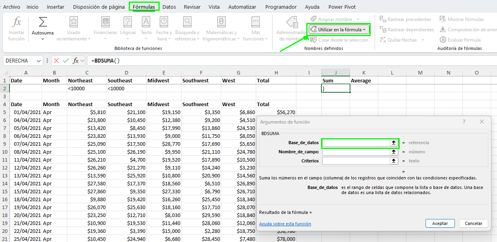

Paso 5. Presiona Tab y en el cuadro de _Nombre_de_Campo_ escribe *H4* y presiona Tab

Paso 6. En _criterios_ selecciona *A1:H2* selecciona OK.

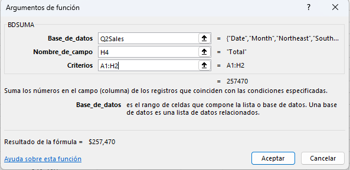

Verifica que las ventas totales para las regiones del Noreste y Sureste, donde las ventas fueron menores a *$10,000*, sean *$257,470.*"

Paso3. Selecciona la celda **K2* y escribe _=BDPROEMDIO(Q2Sales,H4,A1:H2)_.
Verifica que el promedio de las ventas totales para las regiones del Noreste y Sureste, donde las ventas fueron menores a $10,000, sea $64,368.

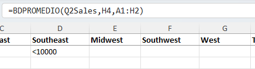

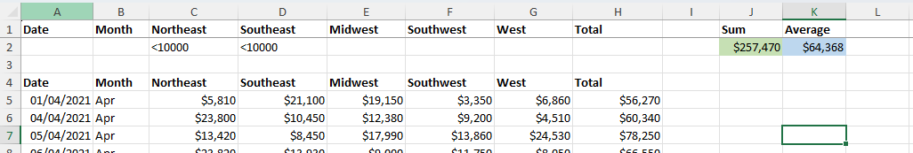

### Tarea 2. Edita los criterios para calcular las ventas totales y promedio de mayo.

Paso 1. Selecciona las celdas *C2:D2*
y presiona Eliminar.

Paso 2. Selecciona la celda B2 y escribe May.
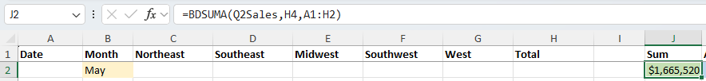

Paso 3. Si es necesario, ajusta el ancho de la columna J y verifica las ventas totales y promedio de mayo.

Paso 4. Guarda el libro de trabajo 

### Resultado esperado
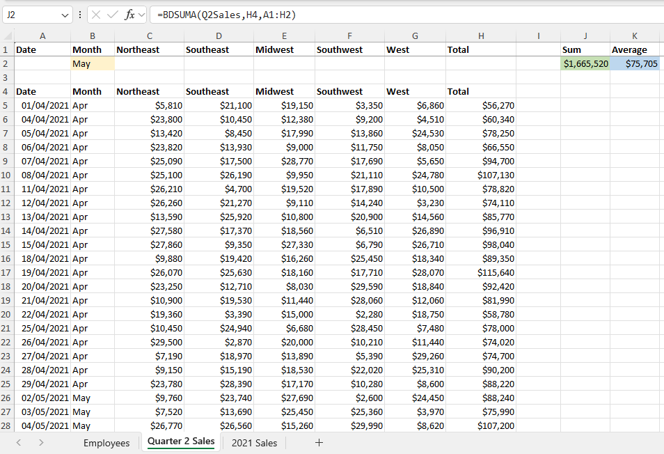
