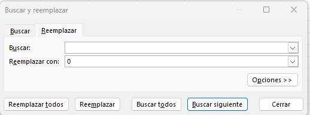
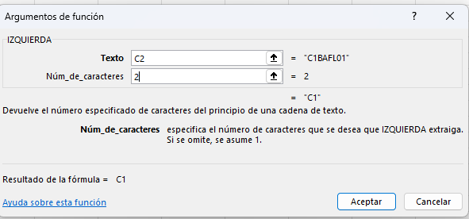
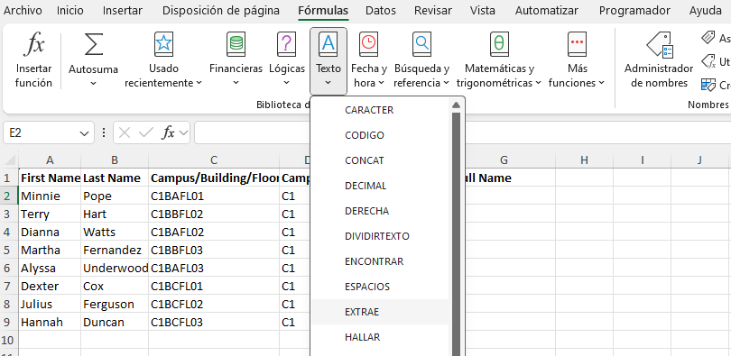
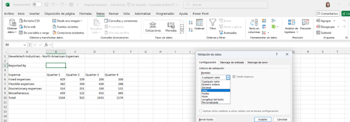
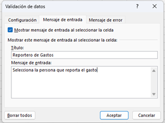
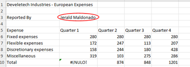
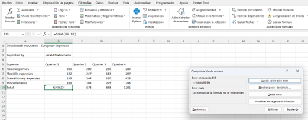

# Limpieza de Datos 

## Objetivo de la práctica:
Al finalizar la práctica, serás capaz de:
- Identificar y eliminar registros duplicados en un conjunto de datos:

* Aprender a detectar y eliminar filas duplicadas utilizando la función Eliminar duplicados en Excel.

* Comprender cómo seleccionar columnas relevantes para definir duplicados de manera precisa.

* Aprender a identificar celdas vacías dentro de un conjunto de datos utilizando diversas técnicas como filtros y formato condicional.

* Aplicar diferentes métodos para llenar las celdas vacías

## Duración aproximada:
- 15 minutos.

## Instrucciones 

### Tarea 1. Eliminar registro duplicados

Paso 1. Abre el archivo :
[Empleaados e invitados](<Empleados e invitados.xlsx>) 

y verifica que la hora de trabajo Empleados esté seleccionada. 

Paso 2. Se tienen las columnas de Nombre, apellido, dirección, ciudad, estado, código postal, teléfono y correo electrónico, hay múltiples registros duplicados por lo cual hay que escoger la columna correo y télefono, ya que podemos tener nombres repetidos, pero no es la misma persona, lo mismo el apellido y la ciudad. 

Ir a *Inicio -> Formato condicional -> Reglas para resltar Celdas -> valores duplicados*

Paso 3. Dar clic en aceptar manteniendo el color de rojo oscuro para resaltar las celas duplicadas 

Paso 4. Revisamos que se tienen varios registros de color rojo, significa que hay duplicados en los datos. Seleccionamos de nuevo la columna Teléfono y correo electrónico. Dar clic en *Datos -> Eliminar duplicados* 
Se despliega una ventana y dar clic en aceptar. 

Paso. 5 Revisar el mensaje de alerta que indica cuantos duplicados se eliminaron y revisar que ya no haya ninguna celda pintada de color rojo.

### Tarea 2. Completar la información

Se tiene los registros de los asistentes a un evento, los cuales se ocuparán para analizar más adelante, se busca ver con que información se cuenta y con cual no, pero no debe quedar niguna celda en blanco. 

Paso 1. Ir a la pestaña llamada Asistentes

Paso 2. Seleccionamos la celda de *D* de correo eléctronico que vamos a eliminar, ya que la información no nos va a funcionar puesto que buscaremos en el futuro contactar a los asistentes para más eventos. Dar clic en *Incio -> Buscar y seleccionar -> Ir a especial*

Selecciona Celdas en blanco

Paso 3. Una vez que se seleccionan las celdas en blanco, da clic derecho y damos clic en eliminar, en el cuadro que se despliegue dar clic en la opción *Toda la fila* 

Paso 4. Selecciona la columna edad presiona *Ctrl + B* en tu teclad, se despliega una ventana y seleccionamos la pestaña reeplazar.
En el campo *Buscar* dejalo en blanco, para indicar que se van a buscar las celdas en blanco.

En el campo remplazar con y escribe el valor 0 y después dar clic en *reemplazar todos* 

Saldra un mensaje del número de reemplazos que se hicieron

Paso 5. Hacemos lo mismo para la columna nombre y apellido de tal manera que en las celdas aparezca *N/A*, puedes ayudarte seleccionando ambas columnas en vez de una sola columna como lo fue en el caso de la edad y hacer el reemplado por *N/A*

### Resultado esperado
En esta sección se debe mostrar el resultado esperado de nuestro laboratorio

# Trabajando con funciones de limpieza de texto

## Objetivo de la práctica:
Al finalizar la práctica, serás capaz de:
- Utilizar las funciones IZQUIERDA, DERECHA, y EXTRAE para extraer partes específicas de texto dentro de una celda.

- Aplicar la función CONCAT para combinar datos de múltiples celdas en una sola cadena de texto.

## Duración aproximada:
- 10 minutos.

## Instrucciones 

### Escenario:

Eres un generalista de Recursos Humanos en Develetech Industries. Tu empresa tiene un gran campus con edificios de varios pisos. Para localizar a un empleado en cualquiera de los edificios del campus, se te ha pedido que extraigas varias partes de datos de un texto proporcionado por tu gerente. Los dos primeros caracteres del código representan la notación del campus, los siguientes dos caracteres representan el código del edificio, y los últimos cuatro caracteres representan la ubicación en el piso. Para hacer esto, utilizarás funciones de texto.

### Tarea 1. Selecciona la hoja de cálculo Campus Information

Paso 1. Abre el archivo :
[Campus information](<Campus information.xlsx>) 

### Tarea 2.Extrae el código del campus, los dos primeros caracteres, del campo combinado.

Paso 1. Asegúrate de que la celda D2 esté seleccionada.

Paso 2. Selecciona __Fórmulas > Texto > IZQUIERDA._

Paso 3. En el cuadro de texto Texto, escribe **C2* y presiona Tab.

Paso 4.  En el cuadro de texto Num_caracteres, escribe 2 y selecciona Aceptar.Verifica que el código del campus fue extraído.

### Tarea 3. Extrae el código del edificio, el tercer y cuarto caracteres, del campo combinado.

Paso 1. Selecciona la celda E2 

Paso 2. Selecciona __Fórmulas > Texto > EXTRAE._

Paso 3. En el cuadro de texto __Texto_, escribe *C2* y presiona Tab.

Paso 4.  En el cuadro de texto __Posición_inicial_, escribe 3 y presiona Tab.

Paso 5. En el _Núm_de_caracteres_ escribe 2 y presiona Tab

### Tarea 4. Extrae el código del piso, los últimos cuatro caracteres, del campo combinado.

Paso 1. Selecciona la celda *F2.*

Paso 2.  Selecciona _Fórmulas > Texto > DERECHA._

Paso 3. En el cuadro de texto Texto, escribe *C2* y presiona Tab.

Paso 4. En el cuadro de texto _Núm_caracteres_, escribe 4 y selecciona Aceptar.Verifica que el código del piso fue extraído.

 
### Tarea 5. Concatena el nombre y el apellido en un solo campo.

Paso 1.  Selecciona la celda G2.

Paso 2. Escribe =CONCAT y presiona Tab para usar la función de autocompletar de fórmulas.

Paso 2. En el argumento [text1], selecciona o escribe A2 y escribe una coma (,).

Paso 3.  En el argumento [text2], escribe "" y escribe una coma (,).

Nota: Hay un espacio entre las dos comillas.

Paso 4. En el argumento [text3], selecciona o escribe B2 y escribe un paréntesis de cierre ) para completar la función y presiona Ctrl+Enter.

Verifica que el nombre del empleado aparezca en el formato de nombre completo.

### Tarea 6.Relleno Automático en las filas restantes de datos. 

Paso 1. Selecciones las celdas D2:G2 y haz doble clic en el controlador de Relleno automático de la celda G2.
Verifica que el campus, edificio, piso y nombres completos estén listados para todo el personal.

Paso 2. Guarda los cambios y cierra el libro.
### Resultado esperado

# Aplicando Validación de Datos

## Objetivo de la práctica:
Al finalizar la práctica, serás capaz de:
- Configurar listas desplegables basadas en rangos definidos en otra hoja, facilitando la selección de datos predefinidos.

- Personalizar Mensajes de Entrada y Alertas de Error
* Definir límites numéricos mínimos y máximos (por ejemplo, entre 100 y 1,000) para las entradas permitidas en un rango de celdas.

## Duración aproximada:
- 15 minutos.

## Instrucciones 

### Escenario:

Como gerente financiero de Develetech Industries, has estado recopilando los gastos de cada una de las regiones de la empresa. Quieres asegurarte de que los datos que ingreses en el libro de trabajo estén dentro de los parámetros correctos. Decides agregar validación de datos a varias celdas y rangos para prevenir errores en la entrada de datos.

### Tarea 1. Abre el archivo 

Paso 1. Abre el archivo llamado :
[Regional Expenses](<Regional Expenses.xlsx>) 

### Tarea 2. Habilita y configura los ajustes para la validación de datos del reportero de gastos.

Paso 1. Verifica que la hoja de trabajo North American esté seleccionada y selecciona la celda B3.

Paso 2. Selecciona *Datos → Validación de Datos.*

Paso 3. En el cuadro de diálogo de Validación de Datos, selecciona la pestaña Configuraciones si es necesario, y en la lista desplegable Permitir, selecciona Lista.

Paso 4. Selecciona el campo Fuente, luego elige Fórmulas → Usar en Fórmula y selecciona los datos de la pestaña *Valid Data*

Verifica que el campo Fuente sea Reported_By.

### Tarea 3. Configura el mensaje de entrada para la validación de datos.

Paso 1. En el cuadro de diálogo Validación de Datos, selecciona la pestaña *Mensaje de Entrada.*
Verifica que la opción "Mostrar mensaje de entrada cuando se seleccione la celda" (casilla de verificación) esté seleccionada.

Paso 2. Selecciona el campo Título e ingresa: *Reportero de Gastos*.

Paso 3. Presiona Tab y en el campo Mensaje de Entrada, ingresa :Selecciona la persona que reporta el gasto.*

Verifica los ajustes del Mensaje de Entrada.

### Tarea 4. Configura la alerta de error para la validación de datos.

Paso 1. En el cuadro de diálogo Validación de Datos, selecciona la pestaña: *Alerta de Error.* 

Verifica que la casilla Mostrar alerta de error después de que se ingresa un dato no válido esté seleccionada.

Verifica que el Estilo se quede en *Alto*

Paso 2.  Selecciona el campo Título e ingresa: *Reported By Error*. 

Paso 3. Selecciona el campo Mensaje de error e ingresa: Por favor selecciona un usuario de la lista.

 Verifica los ajustes de Alerta de Error y selecciona Aceptar.

 

Paso 4. Verifica que la celda B3 esté seleccionada y que el Mensaje de Entrada se muestre.

Paso 5.  Escribe tu nombre en la celda B3 y presiona Enter.

Paso 6. En el cuadro de diálogo Reported By Error, selecciona Cancelar.

### Tarea 5. Aplica validación de datos a los valores de gastos.

Paso 1. Selecciona el rango B6:E9
Paso 2. Selecciona Datos → Validación de Datos.
Paso 3. En el cuadro de diálogo de Validación de Datos, selecciona la pestaña Configuraciones si es necesario, y en la lista desplegable Permitir, selecciona Decimal.

Paso 4. Verifica que en la lista desplegable Datos esté seleccionada la opción entre.
Paso 5. Selecciona el campo Mínimo e ingresa 100.
Paso 6.Selecciona el campo Máximo e ingresa 1000.

Paso 7. Selecciona la pestaña Mensaje de Entrada y desmarca la casilla Mostrar mensaje de entrada cuando se selecciona la celda.

Paso 8. Selecciona la pestaña Alerta de Error y luego en la lista desplegable Estilo, selecciona Advertencia.

Paso 9. Selecciona el campo Título e ingresa: **Gasto no válido.*

Paso 10. Selecciona el campo Mensaje de Error e ingresa:  *Ingrese un valor entre 100 y 1,000.*

Paso 11.  Selecciona Aceptar para aplicar los ajustes.

### Tarea 6.Probar la validación de datos.

Paso 1. Selecciona la celda B3 y selecciona la flecha desplegable que aparece a la derecha de la celda.
Paso 2. Selecciona Claire Gibbs.

Paso 3. Selecciona la celda E6, escribe 10,000 y presiona Enter.

Paso 4. Verifica que aparezca la alerta de error Gasto no válido.
Gasto no válido
Ingresa un valor entre 100 y 1,000.
¿Continuar?

Paso 5. Selecciona Sí para ignorar la advertencia.

### Resultado esperado

# Aplicando Validación de errores

## Objetivo de la práctica:

- Identificar y Corregir Datos Inválidos Utilizando Herramientas de Validación en Excel.
 * Gestionar y Comprender Configuraciones de Validación de Datos

* Detectar y Solucionar Errores en Fórmulas Utilizando la Comprobación de Errores de Excel

## Duración aproximada:
- 10 minutos.

## Instrucciones 

### Escenario:
Continuando en tu rol como gerente financiero para Develetech Industries, has hecho todo lo posible por verificar que los datos ingresados para cada región sean correctos. Ahora deseas revisar datos inválidos y cualquier problema con las fórmulas. Decides señalar los datos inválidos y corregir las entradas incorrectas.

*Seguir en el archivo llamado *Regional expenses*

### Tarea 1. Buscar entradas de datos inválidos en la hoja de trabajo de Europa.

Paso 1. Selecciona la hoja de trabajo *European.*

Paso 2. En la pestaña Datos, selecciona la flecha desplegable en el botón Validación de datos y luego selecciona Rodear datos inválidos.

Verifica que hay dos celdas que contienen datos inválidos.

### Tarea 2. Corregir los datos inválidos en la hoja de trabajo.

Paso 1. Selecciona la celda B6 e ingresa 280.

#### Nota: Después de ingresar el valor correcto, el círculo de datos inválidos debería desaparecer. Si no, eliminarás los círculos de validación más adelante en esta actividad.

Paso 2. Selecciona la celda B3 y selecciona la flecha desplegable que aparece a la derecha de la celda.

Paso 3. Selecciona Jerald Maldonado.

#### Nota: Los ajustes de validación de datos de Mensaje de entrada y Alerta de error en la hoja de trabajo europea no son los mismos que los ajustes de validación de datos en la hoja de trabajo de América del Norte.

Paso 4. En la pestaña Datos, selecciona la flecha desplegable en el botón Validación de datos y luego selecciona Borrar círculos de validación.

### Tarea 3. Revisar la hoja de trabajo en busca de errores en las fórmulas.

Paso 1.  Navega a la celda A1.

Paso 2. Selecciona Fórmulas -> Comprobación de Errores.
Verifica que el cuadro de diálogo de Comprobación de Errores encontró un error en la celda B10.

Paso 3. Selecciona Modificiar en la Barra de Fórmulas.

Paso 4. Corrige el error escribiendo un dos puntos (:) entre el rango B6. La fórmula debe ser:

*=SUMA(B6:B9)*

Paso 5. Presiona Enter.

Paso 6.  En el cuadro de diálogo Revisión de Errores, selecciona Reanudar.

Paso 7.  En el cuadro de diálogo de Microsoft Excel, verifica que la revisión de errores se ha completado y selecciona OK.

### Resultado esperado

