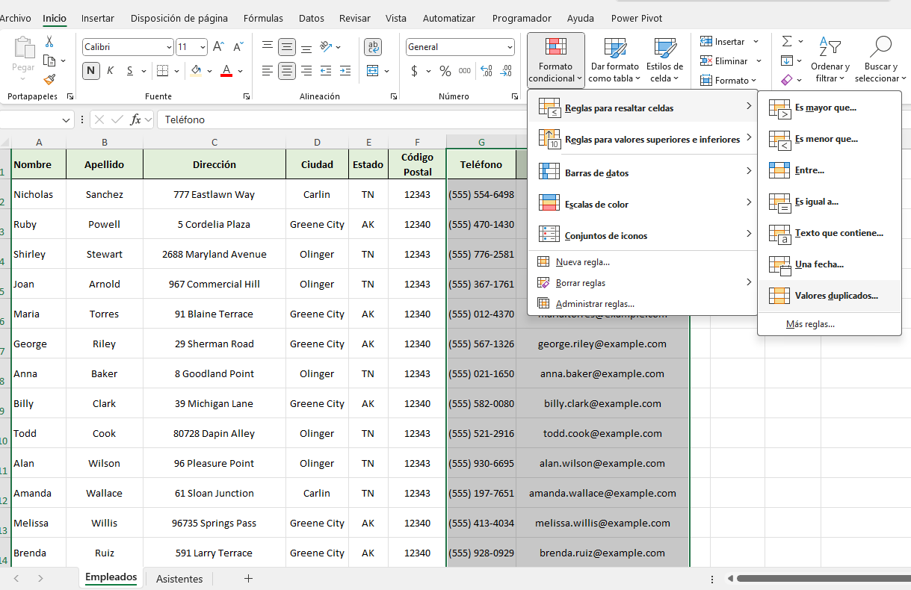
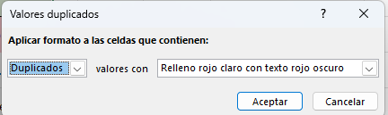
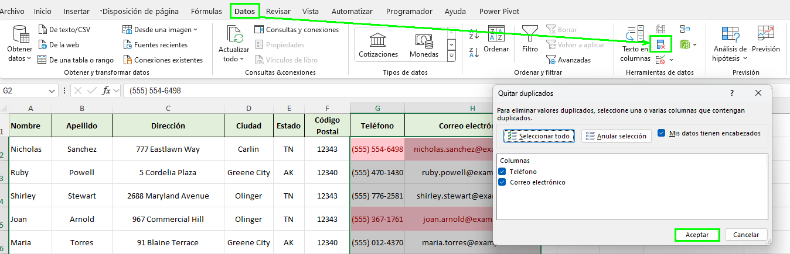
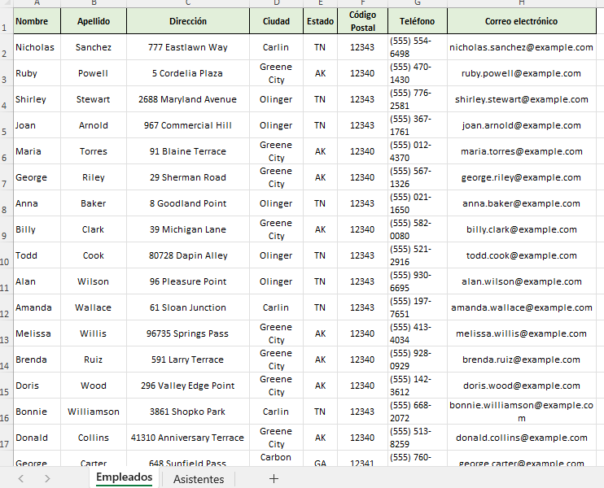
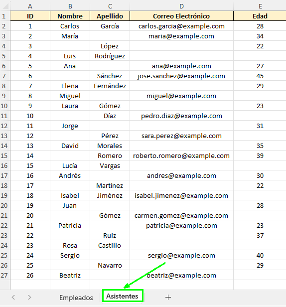
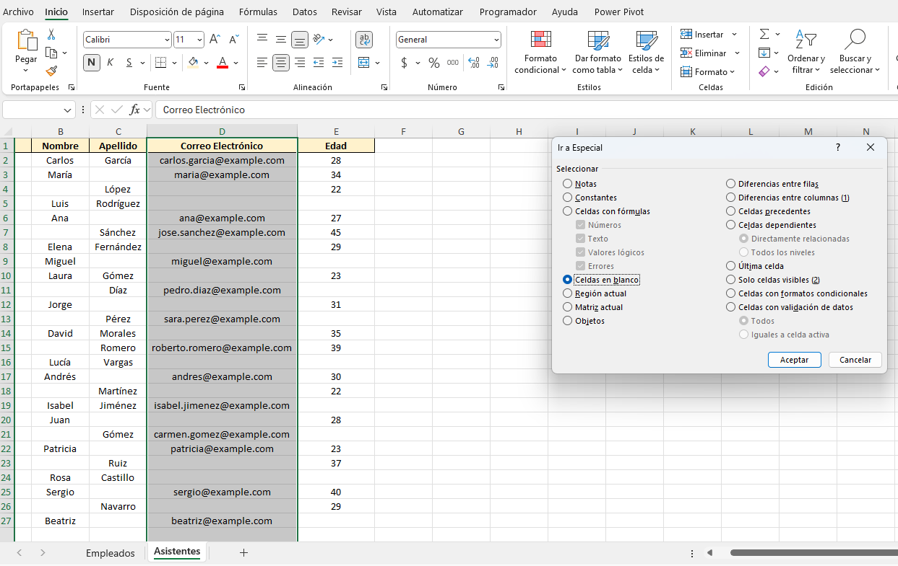
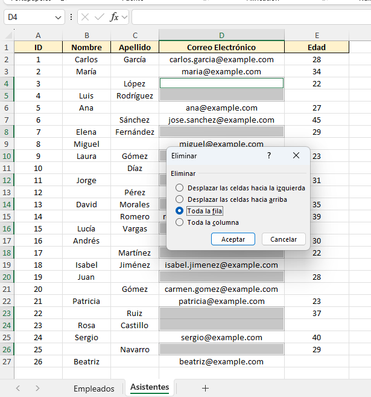
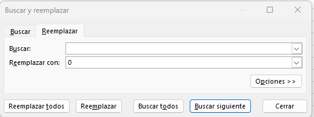
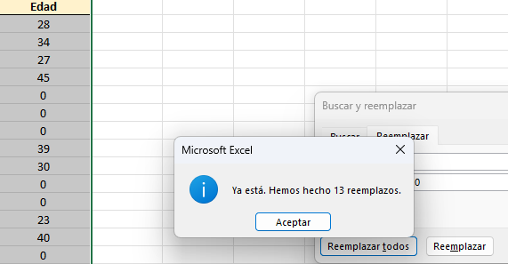
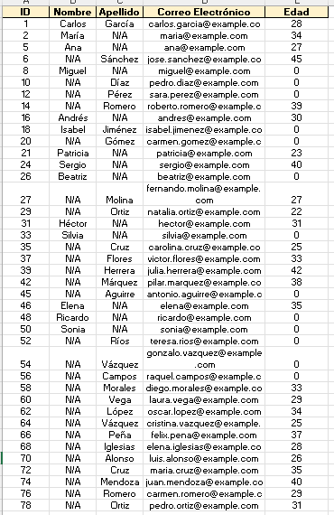

# Práctica 3.1. Limpieza de Datos.

## Objetivo de la práctica:

Al finalizar la práctica, serás capaz de:

Identificar y eliminar registros duplicados en un conjunto de datos:

- Aprender a detectar y eliminar filas duplicadas utilizando la función Eliminar duplicados en Excel.  
- Comprender cómo seleccionar columnas relevantes para definir duplicados de manera precisa. 
- Aprender a identificar celdas vacías dentro de un conjunto de datos utilizando diversas técnicas como filtros y formato condicional.  
- Aplicar diferentes métodos para llenar las celdas vacías.  

## Duración aproximada:
- 15 minutos.

## Instrucciones:

### Tarea 1. Eliminar registro duplicados.

**Paso 1.** Abre el archivo [Empleados e invitados](<Empleados e invitados.xlsx>) y verifica que la hora de trabajo _Empleados_ está seleccionada. 

**Paso 2.** Tienes las columnas de _Nombre_, _apellido_, _dirección_, _ciudad_, _estado_, _código postal_, _teléfono_ y _correo electrónico_. Asimismo, hay múltiples registros duplicados, para lo cual debes escoger la columna de _correo_ y _télefono_, ya que puedes tener nombres repetidos; es decir, no es la misma persona, sino el mismo apellido y la ciudad. 

Dirígete a *Inicio > Formato condicional > Reglas para resltar Celdas > Valores duplicados*.

**Paso 3.** Da clic en **Aceptar** manteniendo el color de rojo oscuro para resaltar las celdas duplicadas. 

**Paso 4.** Revisa que se tienen distintos registros de color rojo, esto significa que hay duplicados en los datos. Selecciona de nuevo la columna _Teléfono_ y _Correo electrónico_. Posteriormente, da clic en *Datos > Eliminar duplicados*.

De esta forma, se desplegará una ventana, donde deberás hacer clic en **Aceptar**. 

**Paso. 5** Revisa el mensaje de alerta que indica cuántos duplicados se eliminaron e inspecciona que ya no haya ninguna celda pintada de color rojo.

### Tarea 2. Completar la información.

Se tiene los registros de los asistentes a un evento, los cuales serán utilizados más adelante para analizar, se busca ver con qué información se cuenta y con cuál no; sin emabrgo, no debe quedar niguna celda en blanco. 

**Paso 1.** Dirígete a la pestaña _Asistentes_.

**Paso 2.** Selecciona la celda de **D** de _correo eléctronico_ la cual vas eliminar, ya que la información no te va a funcionar puesto que buscarás en el futuro contactar a los asistentes para más eventos. Da clic en *Incio > Buscar y seleccionar > Ir a especial*.

Selecciona **Celdas en blanco**.

**Paso 3.** Una vez que has seleccionado las celdas en blanco, da clic derecho y después en **Eliminar**. Posteriormente, en el cuadro que se despliegue, haz clic en la opción **Toda la fila**.

**Paso 4.** Selecciona la columna _edad_ y presiona `Ctrl + B` en tu teclado. Esto desplegará una ventana y selecciona la pestaña **Reeplazar**.

En el campo *Buscar*, déjalo en blanco para indicar que se van a buscar las celdas en blanco.

En el campo **Remplazar con**, escribe el valor `0` y da clic en **Reemplazar todos**.

Saldrá un mensaje del número de reemplazos que se realizaron.

**Paso 5.** Haz lo mismo para la columna _nombre_ y _apellido_ de tal manera que en las celdas aparezca *N/A*; puedes ayudarte seleccionando ambas columnas en vez de una sola, tal como lo fue en el caso de la _edad_ y hacer el reemplado por **N/A**.

### Resultado esperado:

## [Menú principal](../README.md)

## [Práctica 2.](../Capítulo2/README.md)

## [Práctica 3.2. Trabajando con funciones de limpieza de texto.](../Capítulo3/README_3.2.md)
