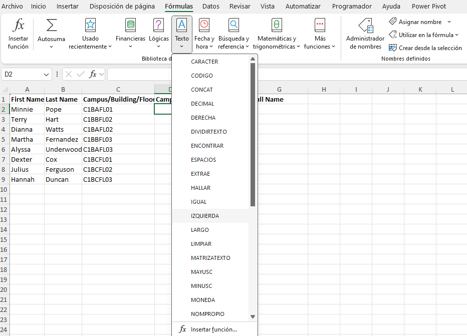
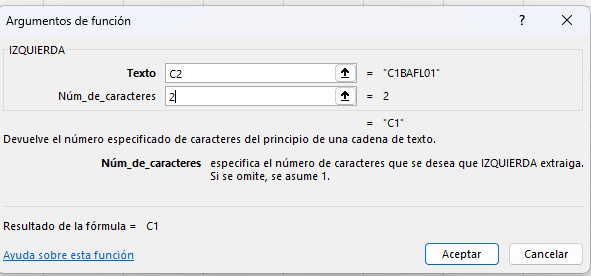
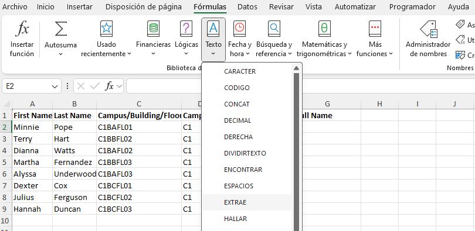
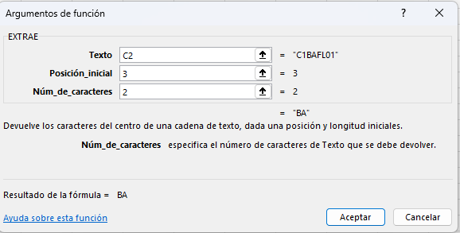
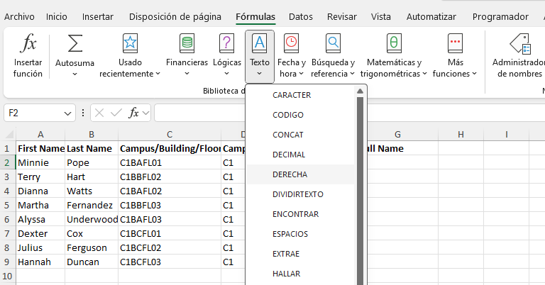
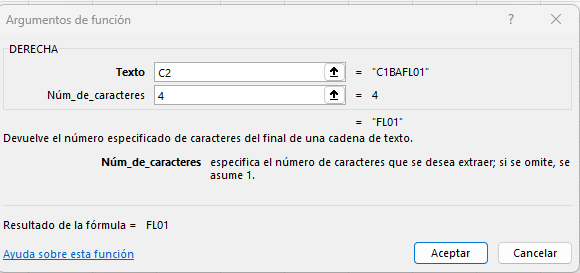
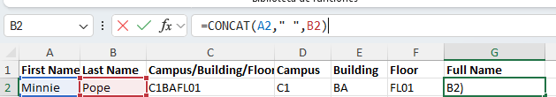
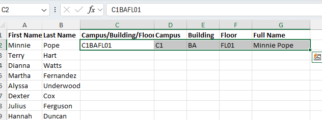
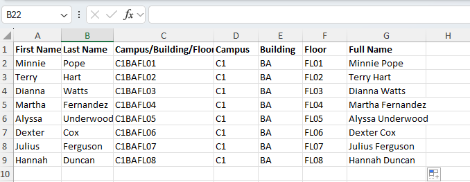

# Práctica 3.2. Trabajando con funciones de limpieza de texto.

## Objetivo de la práctica:

Al finalizar la práctica, serás capaz de:

- Utilizar las funciones IZQUIERDA, DERECHA, y EXTRAE para extraer partes específicas de texto dentro de una celda.  
- Aplicar la función CONCAT para combinar datos de múltiples celdas en una sola cadena de texto.

## Duración aproximada:
- 10 minutos.

## Instrucciones:

### Escenario:

Eres un generalista de Recursos Humanos en Develetech Industries. Tu empresa tiene un gran campus con edificios de varios pisos; para localizar a un empleado en cualquiera de los edificios del campus, se te ha solicitado que extraigas varias partes de datos de un texto proporcionado por tu gerente. Los dos primeros caracteres del código representan la notación del campus, los siguientes dos representan el código del edificio y los últimos cuatro representan la ubicación en el piso. Para hacer esto, deberás utilizar funciones de texto.

### Tarea 1. Selecciona la hoja de cálculo _Campus Information_.

**Paso 1.** Abre el archivo [Campus information](<Campus information.xlsx>).

### Tarea 2. Extraer el código del campus, los dos primeros caracteres, del campo combinado.

**Paso 1.** Asegúrate de que la celda **D2** esté seleccionada.

**Paso 2.** Selecciona _Fórmulas > Texto > IZQUIERDA_.

**Paso 3.** En el cuadro de texto _Texto_, escribe `C2` y presiona **Tab**.

**Paso 4.** En el cuadro de texto _Num_caracteres_, escribe `2` y selecciona **Aceptar**. Verifica que el código del campus fue extraído.

### Tarea 3. Extraer el código del edificio, el tercer y cuarto caracter, del campo combinado.

**Paso 1.** Selecciona la celda **E2**.

**Paso 2.** Selecciona _Fórmulas > Texto > EXTRAE_.

**Paso 3.** En el cuadro de texto _Texto_, escribe `C2` y presiona **Tab**.

**Paso 4.** En el cuadro de texto _Posición_inicial_, escribe `3` y presiona **Tab**.

**Paso 5.** En el _Núm_de_caracteres_, escribe `2` y presiona **Tab**.

### Tarea 4. Extraer el código del piso, los últimos cuatro caracteres, del campo combinado.

**Paso 1.** Selecciona la celda **F2**.

**Paso 2.**  Selecciona _Fórmulas > Texto > DERECHA_.

**Paso 3.** En el cuadro de texto _Texto_, escribe `C2` y presiona **Tab**.

**Paso 4.** En el cuadro de texto _Núm_caracteres_, escribe `4` y selecciona **Aceptar**. Verifica que el código del piso fue extraído.

 
### Tarea 5. Concatenar el nombre y el apellido en un sólo campo.

**Paso 1.**  Selecciona la celda **G2**.

**Paso 2.** Escribe `=CONCAT` y presiona **Tab** para usar la función de autocompletar de fórmulas.

**Paso 3.** En el argumento [text1], selecciona o escribe **A2** y escribe una coma (,).

**Paso 4.** En el argumento [text2], escribe `" "` y después una coma (,).

**Nota:** Hay un espacio entre las dos comillas.

**Paso 5.** En el argumento [text3], selecciona o escribe **B2** y escribe un paréntesis de cierre `)` para completar la función y presiona **Ctrl + Enter**.

**Nota:** Verifica que el nombre del empleado aparezca en el formato de nombre completo.

### Tarea 6. Relleno Automático en las filas restantes de datos. 

**Paso 1.** Selecciona las celdas **D2:G2** y haz doble clic en el controlador de Relleno automático de la celda **G2**.

**Nota:** Verifica que el campus, edificio, piso y nombres completos estén listados para todo el personal.

**Paso 2.** Guarda los cambios y cierra el libro.

### Resultado esperado:

