# Práctica 3.3. Aplicando validación de datos.

## Objetivo de la práctica:

Al finalizar la práctica, serás capaz de:

- Configurar listas desplegables basadas en rangos definidos en otra hoja, facilitando la selección de datos predefinidos.  
- Personalizar _Mensajes de Entrada_ y _Alertas de Error_.  
- Definir límites numéricos mínimos y máximos (por ejemplo, entre 100 y 1,000) para las entradas permitidas en un rango de celdas.

## Duración aproximada:
- 15 minutos.

## Instrucciones:

### Escenario:

Como gerente financiero de Develetech Industries, has estado recopilando los gastos de cada una de las regiones de la empresa. Quieres asegurarte de que los datos que ingreses en el libro de trabajo estén dentro de los parámetros correctos. Decides agregar validación de datos a varias celdas y rangos para prevenir errores en la entrada de datos.

### Tarea 1. Abre el archivo 

**Paso 1. Abre el archivo llamado :
[Regional Expenses](<Regional Expenses.xlsx>) 

### Tarea 2. Habilita y configura los ajustes para la validación de datos del reportero de gastos.

**Paso 1. Verifica que la hoja de trabajo North American esté seleccionada y selecciona la celda B3.

**Paso 2. Selecciona *Datos → Validación de Datos.*

**Paso 3. En el cuadro de diálogo de Validación de Datos, selecciona la pestaña Configuraciones si es necesario, y en la lista desplegable Permitir, selecciona Lista.

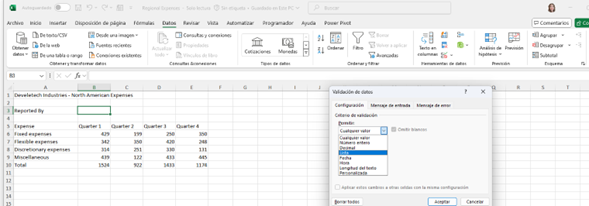

**Paso 4. Selecciona el campo Fuente, luego elige Fórmulas → Usar en Fórmula y selecciona los datos de la pestaña *Valid Data*

Verifica que el campo Fuente sea Reported_By.

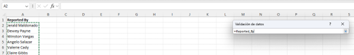

### Tarea 3. Configura el mensaje de entrada para la validación de datos.

**Paso 1. En el cuadro de diálogo Validación de Datos, selecciona la pestaña *Mensaje de Entrada.*
Verifica que la opción "Mostrar mensaje de entrada cuando se seleccione la celda" (casilla de verificación) esté seleccionada.

**Paso 2. Selecciona el campo Título e ingresa: *Reportero de Gastos*.

**Paso 3. Presiona Tab y en el campo Mensaje de Entrada, ingresa :Selecciona la persona que reporta el gasto.*

Verifica los ajustes del Mensaje de Entrada.

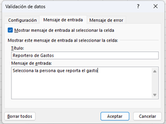

### Tarea 4. Configura la alerta de error para la validación de datos.

**Paso 1. En el cuadro de diálogo Validación de Datos, selecciona la pestaña: *Alerta de Error.* 

Verifica que la casilla Mostrar alerta de error después de que se ingresa un dato no válido esté seleccionada.

Verifica que el Estilo se quede en *Alto*

**Paso 2.  Selecciona el campo Título e ingresa: *Reported By Error*. 

**Paso 3. Selecciona el campo Mensaje de error e ingresa: Por favor selecciona un usuario de la lista.

 Verifica los ajustes de Alerta de Error y selecciona Aceptar.

 
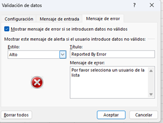

**Paso 4. Verifica que la celda B3 esté seleccionada y que el Mensaje de Entrada se muestre.

**Paso 5.  Escribe tu nombre en la celda B3 y presiona Enter.

**Paso 6. En el cuadro de diálogo Reported By Error, selecciona Cancelar.

### Tarea 5. Aplica validación de datos a los valores de gastos.

**Paso 1. Selecciona el rango B6:E9
**Paso 2. Selecciona Datos → Validación de Datos.
**Paso 3. En el cuadro de diálogo de Validación de Datos, selecciona la pestaña Configuraciones si es necesario, y en la lista desplegable Permitir, selecciona Decimal.

**Paso 4. Verifica que en la lista desplegable Datos esté seleccionada la opción entre.
**Paso 5. Selecciona el campo Mínimo e ingresa 100.
**Paso 6.Selecciona el campo Máximo e ingresa 1000.

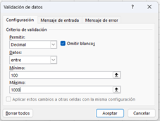

**Paso 7. Selecciona la pestaña Mensaje de Entrada y desmarca la casilla Mostrar mensaje de entrada cuando se selecciona la celda.

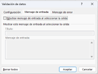

**Paso 8. Selecciona la pestaña Alerta de Error y luego en la lista desplegable Estilo, selecciona Advertencia.

**Paso 9. Selecciona el campo Título e ingresa: **Gasto no válido.*

**Paso 10. Selecciona el campo Mensaje de Error e ingresa:  *Ingrese un valor entre 100 y 1,000.*

**Paso 11.  Selecciona Aceptar para aplicar los ajustes.

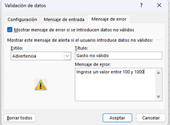

### Tarea 6.Probar la validación de datos.

**Paso 1. Selecciona la celda B3 y selecciona la flecha desplegable que aparece a la derecha de la celda.
**Paso 2. Selecciona Claire Gibbs.

**Paso 3. Selecciona la celda E6, escribe 10,000 y presiona Enter.

**Paso 4. Verifica que aparezca la alerta de error Gasto no válido.
Gasto no válido
Ingresa un valor entre 100 y 1,000.
¿Continuar?

**Paso 5. Selecciona Sí para ignorar la advertencia.

### Resultado esperado

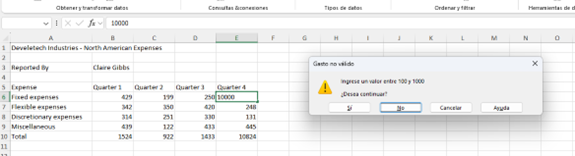

# Aplicando Validación de errores

## Objetivo de la práctica:

- Identificar y Corregir Datos Inválidos Utilizando Herramientas de Validación en Excel.
 * Gestionar y Comprender Configuraciones de Validación de Datos

* Detectar y Solucionar Errores en Fórmulas Utilizando la Comprobación de Errores de Excel

## Duración aproximada:
- 10 minutos.

## Instrucciones 

### Escenario:
Continuando en tu rol como gerente financiero para Develetech Industries, has hecho todo lo posible por verificar que los datos ingresados para cada región sean correctos. Ahora deseas revisar datos inválidos y cualquier problema con las fórmulas. Decides señalar los datos inválidos y corregir las entradas incorrectas.

*Seguir en el archivo llamado *Regional expenses*

### Tarea 1. Buscar entradas de datos inválidos en la hoja de trabajo de Europa.

**Paso 1. Selecciona la hoja de trabajo *European.*

**Paso 2. En la pestaña Datos, selecciona la flecha desplegable en el botón Validación de datos y luego selecciona Rodear datos inválidos.

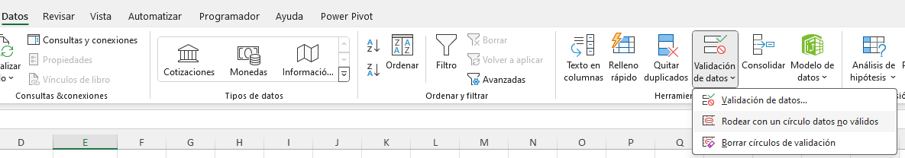

Verifica que hay dos celdas que contienen datos inválidos.

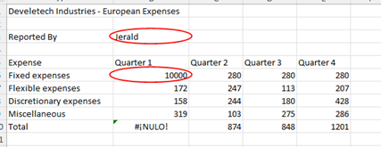

### Tarea 2. Corregir los datos inválidos en la hoja de trabajo.

**Paso 1. Selecciona la celda B6 e ingresa 280.

#### Nota: Después de ingresar el valor correcto, el círculo de datos inválidos debería desaparecer. Si no, eliminarás los círculos de validación más adelante en esta actividad.

**Paso 2. Selecciona la celda B3 y selecciona la flecha desplegable que aparece a la derecha de la celda.

**Paso 3. Selecciona Jerald Maldonado.

#### Nota: Los ajustes de validación de datos de Mensaje de entrada y Alerta de error en la hoja de trabajo europea no son los mismos que los ajustes de validación de datos en la hoja de trabajo de América del Norte.

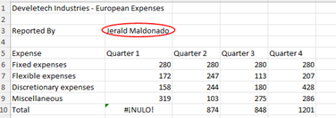

**Paso 4. En la pestaña Datos, selecciona la flecha desplegable en el botón Validación de datos y luego selecciona Borrar círculos de validación.

### Tarea 3. Revisar la hoja de trabajo en busca de errores en las fórmulas.

**Paso 1.  Navega a la celda A1.

**Paso 2. Selecciona Fórmulas -> Comprobación de Errores.
Verifica que el cuadro de diálogo de Comprobación de Errores encontró un error en la celda B10.

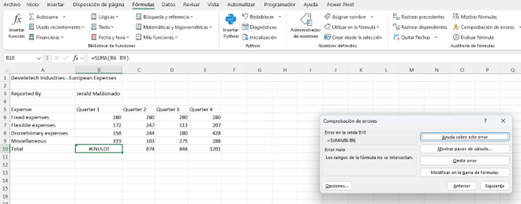

**Paso 3. Selecciona Modificiar en la Barra de Fórmulas.

**Paso 4. Corrige el error escribiendo un dos puntos (:) entre el rango B6. La fórmula debe ser:

*=SUMA(B6:B9)*

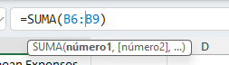

**Paso 5. Presiona Enter.

**Paso 6.  En el cuadro de diálogo Revisión de Errores, selecciona Reanudar.

**Paso 7.  En el cuadro de diálogo de Microsoft Excel, verifica que la revisión de errores se ha completado y selecciona OK.

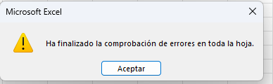

### Resultado esperado

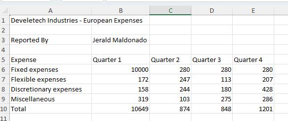

