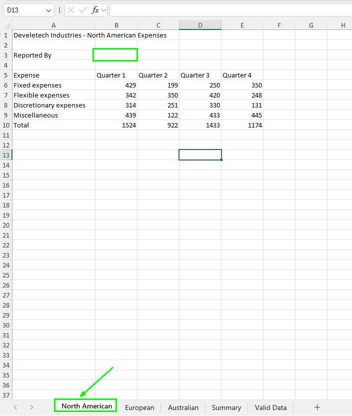

# Práctica 3.3. Aplicando validación de datos.

## Objetivo de la práctica:

Al finalizar la práctica, serás capaz de:

- Configurar listas desplegables basadas en rangos definidos en otra hoja, facilitando la selección de datos predefinidos.  
- Personalizar _Mensajes de Entrada_ y _Alertas de Error_.  
- Definir límites numéricos mínimos y máximos (por ejemplo, entre 100 y 1,000) para las entradas permitidas en un rango de celdas.

## Duración aproximada:
- 15 minutos.

## Instrucciones:

### Escenario:

Como gerente financiero de Develetech Industries, has estado recopilando los gastos de cada una de las regiones de la empresa. Quieres asegurarte de que los datos que ingreses en el libro de trabajo estén dentro de los parámetros correctos. Decides agregar validación de datos a varias celdas y rangos para prevenir errores en la entrada de datos.

### Tarea 1. Abrir el archivo.

**Paso 1.** Abre el archivo llamado [Regional Expenses](<Regional Expenses.xlsx>).

### Tarea 2. Habilitar y configurar los ajustes para la validación de datos del reportero de gastos.

**Paso 1.** Verifica que la hoja de trabajo _North American_ esté seleccionada y, adicionalmente, selecciona la celda **B3**.

**Paso 2.** Selecciona *Datos > Validación de Datos*.

**Paso 3.** En el cuadro de diálogo de _Validación de Datos_, selecciona la pestaña **Configuraciones** si es necesario y, en la lista desplegable _Permitir_, selecciona **Lista**.

**Paso 4.** Selecciona el campo **Fuente**, después elige _Fórmulas > Usar en Fórmula_ y selecciona los datos de la pestaña *Valid Data*.

**Nota:** Verifica que el campo Fuente sea _Reported_By_.

### Tarea 3. Configurar el mensaje de entrada para la validación de datos.

**Paso 1.** En el cuadro de diálogo _Validación de Datos_, selecciona la pestaña **Mensaje de Entrada**.

**Nota:** Verifica que la opción _"Mostrar mensaje de entrada cuando se seleccione la celda"_ (casilla de verificación) esté seleccionada.

**Paso 2.** Selecciona el campo _Título_ e ingresa: `Reportero de Gastos`.

**Paso 3.** Presiona **Tab** y en el campo _Mensaje de Entrada_, ingresa: `Selecciona la persona que reporta el gasto`.

**Nota:** Verifica los ajustes del Mensaje de Entrada.

### Tarea 4. Configura la alerta de error para la validación de datos.

**Paso 1.** En el cuadro de diálogo _Validación de Datos_, selecciona la pestaña: **Alerta de Error**. 

**Notas:**

- Verifica que la casilla _Mostrar alerta de error_, después de que se ingresa un dato no válido, esté seleccionada.  
- Verifica que el *Estilo* se quede en *Alto*.

**Paso 2.**  Selecciona el campo _Título_ e ingresa: `Reported By Error`. 

**Paso 3.** Selecciona el campo _Mensaje de error_ e ingresa: `Por favor selecciona un usuario de la lista`.

**Nota:** Verifica los ajustes de _Alerta de Error_ y selecciona **Aceptar**.

**Paso 4.** Verifica que la celda **B3** esté seleccionada y que el _Mensaje de Entrada_ se muestre.

**Paso 5.** Escribe tu nombre en la celda **B3** y presiona **Enter**.

**Paso 6.** En el cuadro de diálogo _Reported By Error_, selecciona **Cancelar**.

### Tarea 5. Aplicar validación de datos a los valores de gastos.

**Paso 1.** Selecciona el rango **B6:E9**.

**Paso 2.** Selecciona _Datos > Validación de Datos_.

**Paso 3.** En el cuadro de diálogo de _Validación de Datos_, selecciona la pestaña **Configuraciones** si es necesario y, en la lista desplegable _Permitir_, selecciona **Decimal**.

**Paso 4.** Verifica que en la lista desplegable _Datos_ esté seleccionada la opción **entre**.

**Paso 5.** Selecciona el campo _Mínimo_ e ingresa **100**.

**Paso 6.** Selecciona el campo _Máximo_ e ingresa **1000**.

**Paso 7.** Selecciona la pestaña _Mensaje de Entrada_ y desmarca la casilla **Mostrar mensaje de entrada** cuando se selecciona la celda.

**Paso 8.** Selecciona la pestaña _Alerta de Error_ y, en la lista desplegable _Estilo_, selecciona **Advertencia**.

**Paso 9.** Selecciona el campo _Título_ e ingresa: `Gasto no válido`.

**Paso 10.** Selecciona el campo _Mensaje de Error_ e ingresa: `Ingrese un valor entre 100 y 1,000.`

**Paso 11.**  Selecciona **Aceptar** para aplicar los ajustes.

### Tarea 6. Probar la validación de datos.

**Paso 1.** Selecciona la celda **B3** y haz clic en la flecha desplegable que aparece a la derecha de la celda.

**Paso 2.** Selecciona _Claire Gibbs_.

**Paso 3.** Selecciona la celda **E6**, escribe `10,000` y presiona **Enter**.

**Paso 4.** Verifica que aparezca la alerta de error _Gasto no válido_.

Gasto no válido  
Ingresa un valor entre 100 y 1,000.  
¿Continuar?  

**Paso 5.** Selecciona **Sí** para ignorar la advertencia.

### Resultado esperado:

