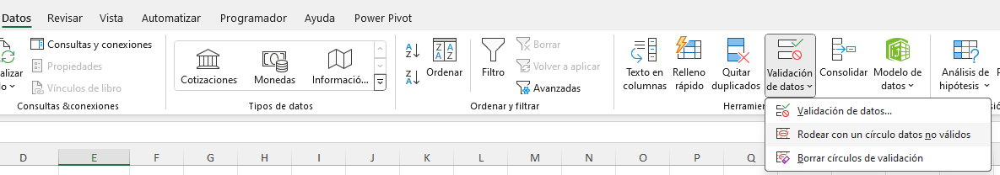
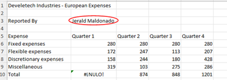
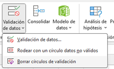
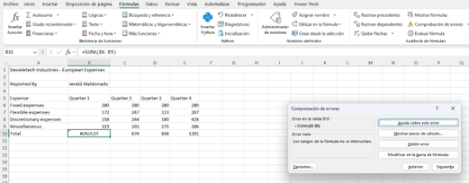
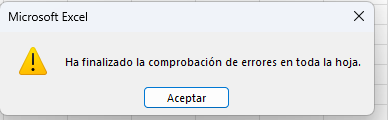
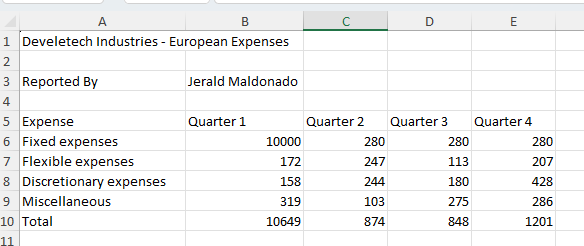

# Práctica 3.4. Aplicando validación de errores.

## Objetivo de la práctica:

Al finalizar la práctica, serás capaz de:

- Identificar y corregir datos inválidos utilizando herramientas de validación en Excel.  
- Gestionar y comprender configuraciones de validación de datos.  
- Detectar y solucionar errores en fórmulas utilizando la comprobación de errores de Excel.

## Duración aproximada:
- 10 minutos.

## Instrucciones:

### Escenario:
Continuando en tu rol como gerente financiero para Develetech Industries, has hecho todo lo posible por verificar que los datos ingresados para cada región sean correctos. Ahora deseas revisar datos inválidos y cualquier problema con las fórmulas. Decides señalar los datos inválidos y corregir las entradas incorrectas.

*Seguir en el archivo llamado *Regional expenses*

### Tarea 1. Buscar entradas de datos inválidos en la hoja de trabajo de Europa.

**Paso 1. Selecciona la hoja de trabajo *European.*

**Paso 2. En la pestaña Datos, selecciona la flecha desplegable en el botón Validación de datos y luego selecciona Rodear datos inválidos.

Verifica que hay dos celdas que contienen datos inválidos.

### Tarea 2. Corregir los datos inválidos en la hoja de trabajo.

**Paso 1. Selecciona la celda B6 e ingresa 280.

#### Nota: Después de ingresar el valor correcto, el círculo de datos inválidos debería desaparecer. Si no, eliminarás los círculos de validación más adelante en esta actividad.

**Paso 2. Selecciona la celda B3 y selecciona la flecha desplegable que aparece a la derecha de la celda.

**Paso 3. Selecciona Jerald Maldonado.

#### Nota: Los ajustes de validación de datos de Mensaje de entrada y Alerta de error en la hoja de trabajo europea no son los mismos que los ajustes de validación de datos en la hoja de trabajo de América del Norte.

**Paso 4. En la pestaña Datos, selecciona la flecha desplegable en el botón Validación de datos y luego selecciona Borrar círculos de validación.

### Tarea 3. Revisar la hoja de trabajo en busca de errores en las fórmulas.

**Paso 1.  Navega a la celda A1.

**Paso 2. Selecciona Fórmulas -> Comprobación de Errores.
Verifica que el cuadro de diálogo de Comprobación de Errores encontró un error en la celda B10.

**Paso 3. Selecciona Modificiar en la Barra de Fórmulas.

**Paso 4. Corrige el error escribiendo un dos puntos (:) entre el rango B6. La fórmula debe ser:

*=SUMA(B6:B9)*

**Paso 5. Presiona Enter.

**Paso 6.  En el cuadro de diálogo Revisión de Errores, selecciona Reanudar.

**Paso 7.  En el cuadro de diálogo de Microsoft Excel, verifica que la revisión de errores se ha completado y selecciona OK.

### Resultado esperado

