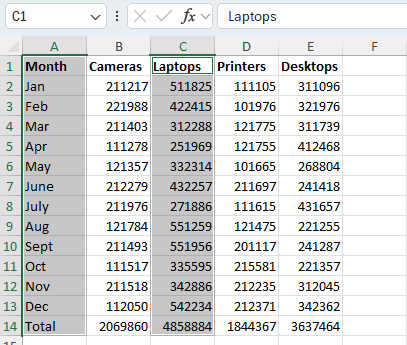

# Práctica 4.1. Trabajando con Funciones Lógicas.

## Objetivo de la práctica:

Al finalizar la práctica, serás capaz de:

- Estructurar fórmulas que integren múltiples niveles de lógica, optimizando la eficiencia y precisión en el análisis de datos.

## Duración aproximada:
- 15 minutos.

## Instrucciones:

## Escenario:

Encabezando el equipo de ventas en Devletech, has recomendado una estructura de compensación tal que se otorgue un bono del 1 por ciento sobre las ventas totales a todos los vendedores que superen sus metas de ventas. Además, para cada categoría con ventas superiores a $85,000, se les otorgará un bono del 1 por ciento de las ventas de esa categoría. También deseas contar el número de veces que un empleado alcanza la meta de la categoría. Usarás funciones lógicas para calcular rápida y fácilmente estos bonos.

### Tarea 1. Descripción de la tarea a realizar.

Paso 1.Abre el archivo  llamado [BONUS](<BONUS.xlsx>)

Paso 2. Verifica que la celda J8 esté seleccionada 

Paso 3. En la barra de fórmulas, selecciona Insertar Función.Categoría _Lógica_ , selecciona _SI_

Paso 4. En el cuadro de texto Prueba_lógica, escribe G8>H8 y presiona Tab.

Paso 5. En el cuadro de texto _Valor_si_verdadero_, escribe G8*$C$4 y presiona Tab.

Paso 6. En el cuadro de texto _Valor_si_falso_, escribe 0 y selecciona Aceptar.

Paso 7. AutoCompleta la fórmula en las celdas a partir de *J9*, para calcular el bono de objetivo para los demás empleados.
Verifica que un bono de objetivo ha sido ganado por todos menos un empleado.

### Tarea 2. Ingresa una fórmula para calcular el bono de categoría, el 1 por ciento de las ventas para cada categoría superior a $85,000, para los empleados.

Paso 1. Selecciona la celda *K8* y escribe _=$C$4*SUMAR.SI(_

Paso 2.  En la barra de fórmulas, selecciona Insertar Función.

Paso 3. En el cuadro de diálogo Argumentos de Función, en el cuadro de texto _Rango_, escribe *C8:F8* y presiona Tab.

Paso 4. En el cuadro de texto _Criterio_, escribe >85000 y selecciona Aceptar.

Paso 5. AutoCompleta la fórmula en las celdas *K9:K11* para calcular el bono de categoría para los empleados restantes. Verifica que todos los empleados, excepto uno, recibieron un bono de categoría.

### Tarea 3. Ingresa una función para calcular el número de veces que cada empleado recibió un bono de categoría.

Paso 1. En la celda *L8*, escribe _=CONTAR.SI(C8:F8,">"&$C$5)_ y presiona Enter.

Paso 2. AutoCompleta la fórmula en las celdas *L9:L11* para calcular el número de bonos de categoría para los empleados restantes.
Verifica los conteos de cada bono de categoría.

## Continuación
### Escenario
Estás satisfecho con el progreso de tu hoja de cálculo de bonificaciones. Ahora que has calculado los bonos por objetivo y por categoría, así como contado el número de bonos por categoría, deseas probar para ver qué empleados serán premiados con unas vacaciones en el "Círculo de Ganadores". Si los empleados superan sus objetivos y obtienen un bono en dos o más categorías de negocio, serán premiados con unas vacaciones en el "Círculo de Ganadores".
Paso 3. Guarda el libro de trabajo y mantén el archivo abierto.

### Tarea 1. Comienza una fórmula anidada para probar si los empleados reciben las vacaciones del "Círculo de Ganadores"

Paso 1. Verifica que la hoja de cálculo Bonus esté seleccionada y selecciona la celda *N8.*

Paso 2.Escribe =SI(Y( y luego, en la barra de fórmulas, selecciona Insertar Función.

Paso 3. En el cuadro de diálogo Argumentos de Función, en la función _Y_, verifica que tu cursor esté en el cuadro de _Valor_Lógico1._

Paso 4. Escribe *J8>0* y presiona Tab.

Paso 5. En el cuadro de _Valor_Lógico2_, escribe *L8>1.* y da clic en aceptar.

Paso 6. Agrega los argumentos para la parte de la función SI en la función anidada. En la barra de fórmulas, selecciona la función SI.

Paso 7. En el argumento de la función _Valor_si_verdadero_ escribe "Circulo de ganadores"

Paso 8. En el cuadro de texto _Valor_si_falso_, escribe "" y selecciona Aceptar.

### Resultado esperado

# Creando gráficos

## Objetivo de la práctica:
Al finalizar la práctica, serás capaz de:
- Crear gráficos básicos en Excel, seleccionando los tipos de gráficos más adecuados para representar diferentes conjuntos de datos.

- Utilizar herramientas avanzadas de gráficos en Excel, como la inserción de gráficos combinados y la personalización de gráficos recomendados para maximizar el impacto visual en presentaciones y análisis de datos.

## Duración aproximada:
- 15 minutos.

## Instrucciones 

### Escenario:
 Como analista de marketing para Develtech Industries, has recibido el libro de trabajo de Ventas Anuales del equipo de ventas. El gerente de ventas te ha pedido que construyas gráficos para los datos en el libro de trabajo que se usarán en la reunión anual de la empresa.

 
### Tarea 1. Abre el archivo llamado Annual Sales.xlxs.
[Annual Sales](<Annual Sales.xlsx>)

### Tarea 2. Crea un gráfico de columnas agrupadas a partir de los datos de ventas trimestrales.
Paso 1.  Verifica que la hoja de cálculo Quarterly Sales (Ventas Trimestrales) esté seleccionada y selecciona el rango A1:E5

Paso 2. Selecciona _Insertar → Gráficos Recomendados._

Paso 3. Explora los Gráficos Recomendados seleccionando las miniaturas de los gráficos.

Paso 4. Selecciona el primer gráfico recomendado, un gráfico de Columnas Agrupadas, y selecciona Aceptar.

Paso 5. Mueve el gráfico debajo de la tabla, si es necesario.

### Tarea 3. Crea un gráfico de líneas a partir de las ventas mensuales de laptops.

Paso 1. Selecciona la hoja de cálculo Sales Trends (Tendencias de Ventas) y selecciona el rango A1:A13

Paso 2.Mantén presionada la tecla Ctrl y selecciona *C1:C13*

Paso 3.Selecciona _Insertar → Insertar Gráfico de Líneas o Áreas y selecciona Línea, la primera variante de gráfico de líneas en 2-D._ 

### Tarea 4. Crea un gráfico circular a partir de los datos de comparación de ventas.

Paso 1. Selecciona la hoja de cálculo Sales Comparison (Comparación de Ventas) y selecciona el rango *A1:B5*

Paso 2.Selecciona el botón _Análisis Rápido_ y selecciona la pestaña Gráficos.

Paso 3.Pasa el cursor sobre los diferentes tipos de gráficos y selecciona el tipo de gráfico _Circular._

 

Paso 4. Guarda el libro de trabajo como _My Annual Sales.xlsx_ y mantén el archivo abierto.

### Resultado esperado
 
 
 

 # Modificar y Formatear Gráficos 

## Objetivo de la práctica:
Al finalizar la práctica, serás capaz de:
- Modificar y formatear gráficos en Excel, aplicando cambios en los diseños, estilos y tipos de gráficos según las necesidades de presentación

- Ajustar y personalizar elementos específicos del gráfico, como títulos, etiquetas y tamaños de fuente, para mejorar la claridad y el impacto visual de tus datos.

- Trabajar con gráficos avanzados en Excel, incluyendo la modificación de gráficos de líneas, columnas y circulares 3D, así como la configuración de formatos de números y etiquetas.

## Duración aproximada:
- 15 minutos.

## Instrucciones 

### Antes de comenzar
Deberá tener abierto el archivo _Annual Sales_ 

### Escenario:
Como analista de marketing, has compartido tus gráficos iniciales con tu gerente. Tu gerente te ha sugerido que modifiques y formatees estos gráficos para una mejor presentación en la reunión anual de la empresa.

### Tarea 1. Cambia el diseño del gráfico de columnas agrupadas en la hoja de cálculo Quarterly Sales.

Paso 1. Selecciona la hoja de cálculo _Quarterly Sales_ y, si es necesario, selecciona el gráfico de columnas agrupadas.
 

Paso 2. Selecciona _Diseño de Gráfico → Diseño Rápido_ y selecciona Diseño 9 de la galería.

 

### Tarea 2. Cambia los títulos predeterminados en el gráfico de columnas.

Paso 1.  En la pestaña contextual _Formato_, desde la lista desplegable de Elementos del Gráfico, selecciona Título del Gráfico.

 

Paso 2. Selecciona la Barra de Fórmulas y escribe Quarterly Sales y presiona Enter.

 

Paso 3. Selecciona la etiqueta del Título del Eje Vertical (Valor) en el lado izquierdo del gráfico, escribe Sales y presiona Enter.

 

 Paso 4.  Selecciona la etiqueta del Título del Eje Horizontal (Categoría) en la parte inferior del gráfico, escribe 2021 y presiona Enter.

  

  
### Tarea 3. Mueve y cambia el tamaño del gráfico de columnas agrupadas de Quarterly Sales.

Paso 1.  haz clic y arrastra el gráfico de modo que la esquina superior izquierda del gráfico cubra la celda G3.
  

Paso 2. Señala el controlador de tamaño en la esquina inferior derecha hasta que el cursor cambie a un puntero de cambio de tamaño.Haz clic y arrastra para agrandar el gráfico hasta cubrir la celda P20.

  

### Tarea 4. Modifica el estilo del gráfico de líneas de Laptops en la hoja de cálculo Sales Trends.

Paso 1.  Selecciona la hoja de cálculo Sales Trends y, si es necesario, selecciona el gráfico de líneas.

Paso 2. En la pestaña contextual Diseño de Gráfico, en el grupo Estilos de Gráfico, selecciona el botón Más y en la galería selecciona el estilo 12.

   

   

### Tarea 5. Cambia las etiquetas del gráfico de líneas a un formato de moneda.

Paso 1. Selecciona el botón Elementos del Gráfico  y pasa el cursor sobre Etiquetas de Datos. Selecciona la flecha que aparece a la derecha y selecciona Más Opciones en el menú.

  

Paso 2.  En la sección Opciones de Etiqueta, desplázate hacia abajo y selecciona Número para expandir las opciones de formato.
  

Paso 3. En el menú Categoría, selecciona Moneda.
Paso 4. En Decimales, escribe 0.
Paso 5. Cierra el panel de tareas Formato de Etiquetas de Datos.

### Tarea 6. Cambia el tipo de gráfico del gráfico circular en la hoja de cálculo Sales Comparison a un gráfico circular 3D.

Paso 1. Selecciona la hoja de cálculo Sales Comparison y, si es necesario, selecciona el gráfico circular.

Paso 2.  Selecciona Diseño de Gráfico → Cambiar Tipo de Gráfico.

Paso 3. En la categoría Circular, selecciona la segunda variante, Circular 3D, y selecciona Aceptar.

### Tarea 7. Aplica un estilo de gráfico al gráfico circular

Paso 1. Selecciona el botón Estilos de Gráfico.
Paso 2. Selecciona Estilo 1.

Paso 3. Selecciona el botón Elementos del Gráfico y pasa el cursor sobre Etiquetas de Datos. Selecciona la flecha que aparece a la derecha y selecciona Más Opciones en el menú.

Paso 4. En el panel de tareas Formato de Etiquetas de Datos, en la sección Opciones de Etiqueta, marca la casilla Porcentaje y desmarca la casilla Valor.

Paso 5. Cierra el panel de tareas Formato de Etiquetas de Datos. 

Paso 6. En la pestaña Inicio, en la lista desplegable Tamaño de Fuente, selecciona 14.

Paso 7. Guarda los cambios y manten abierto el documento.

### Resultado esperado

