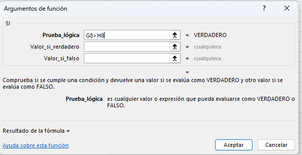
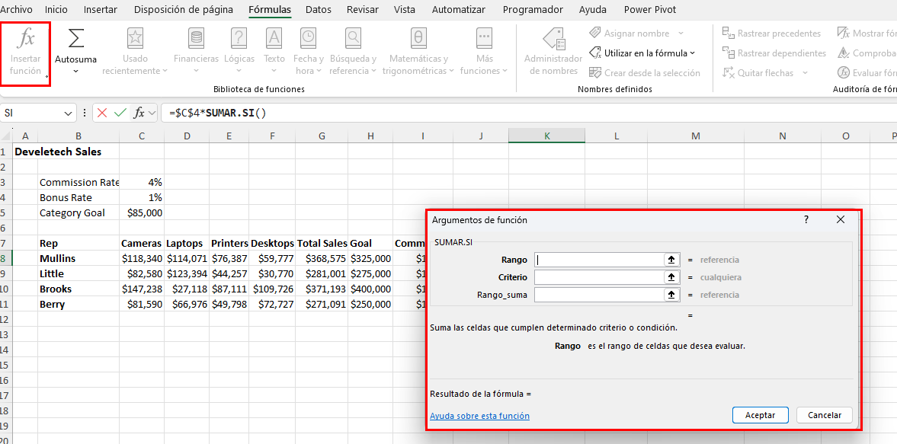
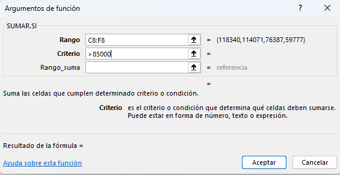
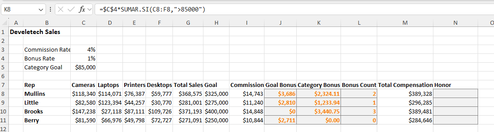
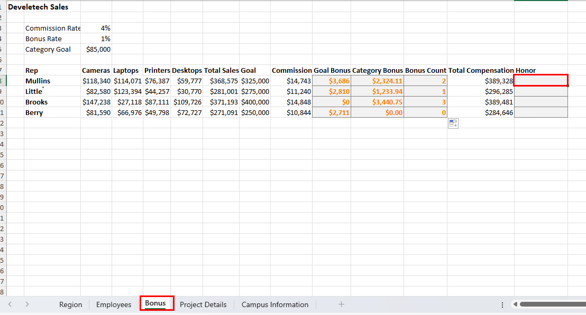
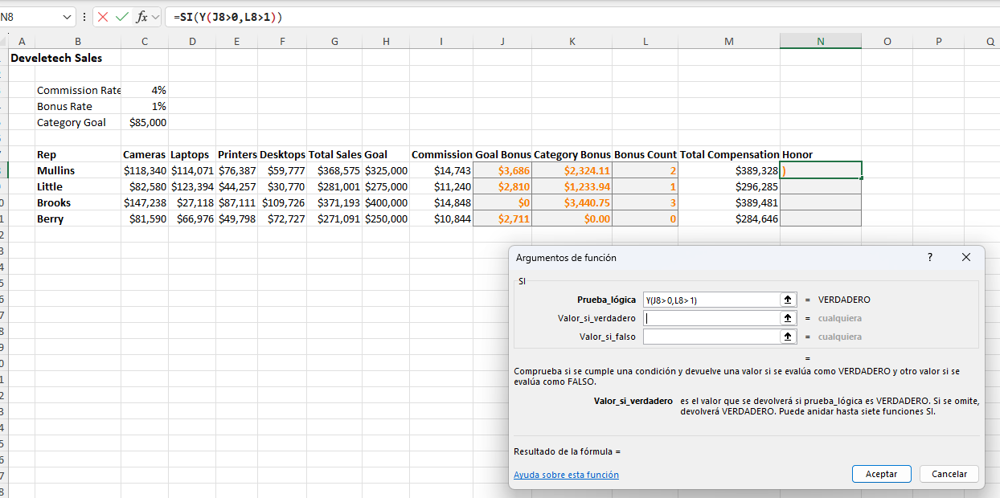

# Práctica 4.1. Trabajando con Funciones Lógicas.

## Objetivo de la práctica:

Al finalizar la práctica, serás capaz de:

- Estructurar fórmulas que integren múltiples niveles de lógica, optimizando la eficiencia y precisión en el análisis de datos.

## Duración aproximada:
- 15 minutos.

## Instrucciones:

## Escenario:

Encabezando el equipo de ventas en Devletech, has recomendado una estructura de compensación, en la cual se otorgue un bono del 1% sobre las ventas totales a todos los vendedores que superen sus metas de ventas. Además, para cada categoría con ventas superiores a $85,000, se les otorgará un bono del 1% de las ventas de esa categoría. Asimismo, deseas contar el número de veces que un empleado alcanza la meta de la categoría. Usa funciones lógicas para calcular rápida y fácilmente estos bonos.

### Tarea 1. Descripción de la tarea a realizar.

**Paso 1.** Abre el archivo llamado: [BONUS](<BONUS.xlsx>).

**Paso 2.** Verifica que la celda **J8** esté seleccionada.

**Paso 3.** En la barra de fórmulas, selecciona **Insertar Función** en la categoría _Lógica_ y da clic en _SI_.

**Paso 4.** En el cuadro de texto *Prueba_lógica*, escribe `G8>H8` y presiona **Tab**.

**Paso 5.** En el cuadro de texto _Valor_si_verdadero_, escribe `G8*$C$4` y presiona **Tab**.

**Paso 6.** En el cuadro de texto _Valor_si_falso_, escribe `0` y selecciona **Aceptar**.

**Paso 7.** Autocompleta la fórmula en las celdas a partir de *J9*, para calcular el bono de objetivo para el resto de los empleados.

**Nota:** Verifica que un bono de objetivo ha sido ganado por todos, menos un empleado.

### Tarea 2. Ingresar una fórmula para calcular el bono de categoría, el 1% de las ventas para cada categoría superior a $85,000, para los empleados.

**Paso 1.** Selecciona la celda *K8* y escribe _=$C$4*SUMAR.SI(_

**Paso 2.** En la barra de fórmulas, selecciona **Insertar función**.

**Paso 3.** En el cuadro de diálogo _Argumentos de Función_, en el cuadro de texto _Rango_, escribe `C8:F8` y presiona **Tab**.

**Paso 4.** En el cuadro de texto _Criterio_, escribe `>85000` y selecciona **Aceptar**.

**Paso 5.** Autocompleta la fórmula en las celdas *K9:K11* para calcular el bono de categoría para los empleados restantes. Verifica que todos los empleados, a excepción de uno, recibieron un bono de categoría.

### Tarea 3. Ingresar una función para calcular el número de veces que cada empleado recibió un bono de categoría.

**Paso 1.** En la celda *L8*, escribe `=CONTAR.SI(C8:F8,">"&$C$5)` y presiona **Enter**.

**Paso 2.** Autocompleta la fórmula en las celdas *L9:L11* para calcular el número de bonos de categoría para los empleados restantes.

**Nota:** Verifica los conteos de cada bono de categoría.

**Paso 3.** Guarda el libro de trabajo y mantén el archivo abierto.

## Continuación

### Escenario:

Estás satisfecho con el progreso de tu hoja de cálculo de bonificaciones. Ahora que has calculado los bonos por objetivo y por categoría, así como contado el número de bonos por categoría, deseas probar para ver qué empleados serán premiados con unas vacaciones en el "Círculo de Ganadores". Si los empleados superan sus objetivos y obtienen un bono en dos o más categorías de negocio, serán premiados con unas vacaciones en el "Círculo de Ganadores".

### Tarea 1. Comenzar una fórmula anidada para probar si los empleados reciben las vacaciones del "Círculo de Ganadores".

**Paso 1.** Verifica que la hoja de cálculo _Bonus_ esté seleccionada y selecciona la celda **N8**.

**Paso 2.** Escribe `=SI(Y(` y posteriormente, en la barra de fórmulas, selecciona **Insertar función**.

**Paso 3.** En el cuadro de diálogo _Argumentos de Función_, en la función _Y_, verifica que tu cursor esté en el cuadro de _Valor_Lógico1_.

**Paso 4.** Escribe `J8>0` y presiona **Tab**.

**Paso 5.** En el cuadro de _Valor_Lógico2_, escribe `L8>1.` y da clic en **Aceptar**.

**Paso 6.** Agrega los argumentos para la parte de la función SI en la función anidada. En la barra de fórmulas, selecciona la función _SI_.

**Paso 7.** En el argumento de la función _Valor_si_verdadero_, escribe `Circulo de ganadores`.

**Paso 8.** En el cuadro de texto _Valor_si_falso_, escribe `""` y selecciona **Aceptar**.

### Resultado esperado:

## [Menú principal](../README.md)

## [Práctica 3.4. Aplicando validación de errores.](../Capítulo3/README_3.4.md)

## [Práctica 4.2. Creando Gráficos.](../Capítulo4/README_4.2.md)
