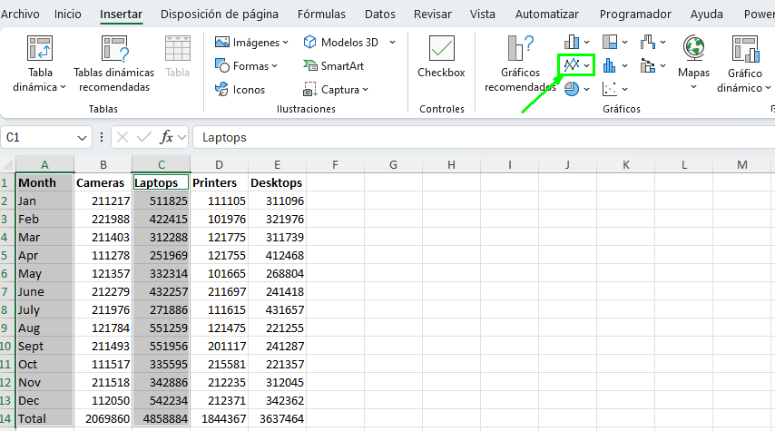
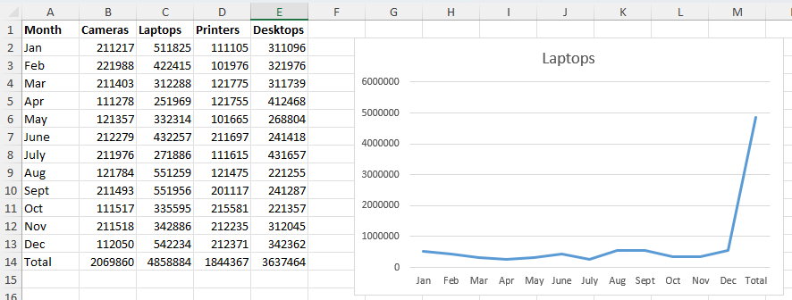
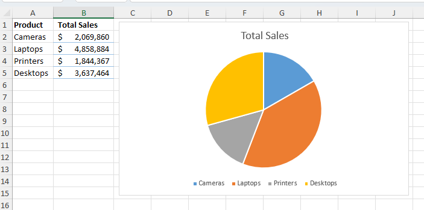

# Práctica 4.2. Creando Gráficos.

## Objetivo de la práctica:

Al finalizar la práctica, serás capaz de:

- Crear gráficos básicos en Excel, seleccionando los tipos de gráficos más adecuados para representar diferentes conjuntos de datos.  
- Utilizar herramientas avanzadas de gráficos en Excel, como la inserción de gráficos combinados y la personalización de gráficos recomendados, para maximizar el impacto visual en presentaciones y análisis de datos.

## Duración aproximada:

- 15 minutos.

## Instrucciones:

### Escenario:

Ahora, como analista de marketing para Develtech Industries, has recibido el libro de trabajo de Ventas Anuales del equipo de ventas. El gerente de ventas te ha pedido que construyas gráficos para los datos en el libro de trabajo que se usarán en la reunión anual de la empresa.

### Tarea 1. Abrir el archivo _Annual Sales.xlxs_.

[Annual Sales](<Annual Sales.xlsx>).

### Tarea 2. Crear un gráfico de columnas agrupadas a partir de los datos de ventas trimestrales.

**Paso 1.**  Verifica que la hoja de cálculo _Quarterly Sales_ (Ventas Trimestrales) esté seleccionada y selecciona el rango **A1:E5**.

**Paso 2.** Selecciona _Insertar > Gráficos Recomendados_.

**Paso 3.** Explora los _Gráficos Recomendados_ seleccionando las miniaturas de los gráficos.

**Paso 4.** Selecciona el primer gráfico recomendado, un gráfico de _Columnas Agrupadas_, y da clic en **Aceptar**.

**Paso 5.** Mueve el gráfico debajo de la tabla, si es necesario.

### Tarea 3. Crear un gráfico de líneas a partir de las ventas mensuales de laptops.

**Paso 1.** Selecciona la hoja de cálculo _Sales Trends_ (Tendencias de Ventas) y selecciona el rango **A1:A13**.

**Paso 2.** Mantén presionada la tecla **Ctrl** y selecciona *C1:C13*.

**Paso 3.** Selecciona _Insertar > Insertar Gráfico de Líneas o Áreas_ y selecciona _Línea_, la primera variante de gráfico de líneas en 2-D.

  

### Tarea 4. Crear un gráfico circular a partir de los datos de comparación de ventas.

**Paso 1.** Selecciona la hoja de cálculo _Sales Comparison_ (Comparación de Ventas) y selecciona el rango **A1:B5**.

**Paso 2.** Selecciona el botón _Análisis Rápido_ y da clic en la pestaña **Gráficos**.

**Paso 3.** Pasa el cursor sobre los diferentes tipos de gráficos y selecciona el tipo de gráfico _Circular_.

 

**Paso 4.** Guarda el libro de trabajo con el nombre de _My Annual Sales.xlsx_ y mantén el archivo abierto.

### Resultado esperado:

   
   
   

## [Menú principal](../README.md)

## [Práctica 4.1. Trabajando con Funciones Lógicas.](../Capítulo4/README_4.1.md)

## [Práctica 4.3. Modificar y formatear gráficos.](../Capítulo4/README_4.3.md)
