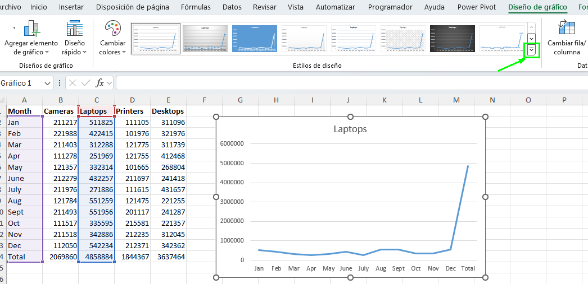
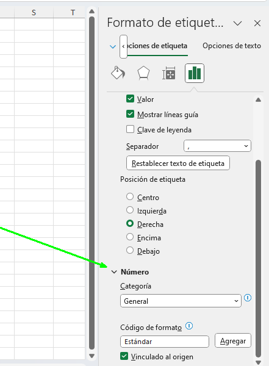
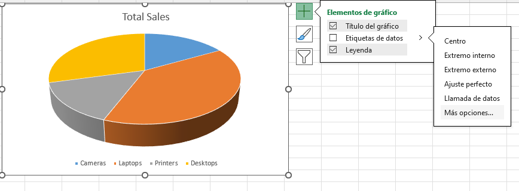
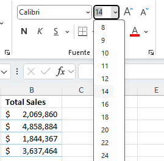

# Práctica 4.3. Modificar y formatear gráficos.

## Objetivo de la práctica:

Al finalizar la práctica, serás capaz de:

- Modificar y formatear gráficos en Excel, aplicando cambios en los diseños, estilos y tipos de gráficos según las necesidades de presentación.
- Ajustar y personalizar elementos específicos del gráfico, como títulos, etiquetas y tamaños de fuente, para mejorar la claridad y el impacto visual de tus datos.
- Trabajar con gráficos avanzados en Excel, incluyendo la modificación de gráficos de líneas, columnas y circulares 3D, así como la configuración de formatos de números y etiquetas.

## Duración aproximada:
- 15 minutos.

## Instrucciones:

### Antes de comenzar:

Deberás tener abierto el archivo _Annual Sales_.

### Escenario:

Como analista de marketing, has compartido tus gráficos iniciales con tu gerente, quien te ha sugerido que modifiques y formatees estos gráficos para una mejor presentación en la reunión anual de la empresa.

### Tarea 1. Cambiar el diseño del gráfico de columnas agrupadas en la hoja de cálculo _Quarterly Sales_.

**Paso 1.** Dirígete a la hoja de cálculo _Quarterly Sales_ y, si es necesario, selecciona el gráfico de columnas agrupadas.
 

**Paso 2.** Selecciona _Diseño de Gráfico > Diseño Rápido_ y escoge el **Diseño 9** de la galería.

 

### Tarea 2. Cambiar los títulos predeterminados en el gráfico de columnas.

**Paso 1.**  En la pestaña contextual _Formato_, desde la lista desplegable de Elementos del Gráfico, selecciona **Título del Gráfico**.

 

**Paso 2.** Selecciona la **Barra de Fórmulas**, escribe `Quarterly Sales` y presiona **Enter**.

 

**Paso 3.** Selecciona la etiqueta del _Título del Eje Vertical_ (Valor) en el lado izquierdo del gráfico, escribe `Sales` y presiona **Enter**.

 

 **Paso 4.** Selecciona la etiqueta del _Título del Eje Horizontal_ (Categoría) en la parte inferior del gráfico, escribe `2021` y presiona **Enter**.

  
  
### Tarea 3. Mover y cambiar el tamaño del gráfico de columnas agrupadas de Quarterly Sales.

**Paso 1.** Haz clic y arrastra el gráfico de modo que la esquina superior izquierda del gráfico cubra la celda **G3**.
  

**Paso 2.** Señala el controlador de tamaño en la esquina inferior derecha hasta que el cursor cambie a un puntero de cambio de tamaño. Haz clic y arrastra para agrandar el gráfico hasta cubrir la celda **P20**.

  

### Tarea 4. Modificar el estilo del gráfico de líneas de Laptops en la hoja de cálculo Sales Trends.

**Paso 1.** Selecciona la hoja de cálculo _Sales Trends_ y, si es necesario, selecciona el gráfico de líneas.

**Paso 2.** En la pestaña contextual _Diseño de Gráfico_, en el grupo Estilos de Gráfico, selecciona el botón **Más** y en la galería selecciona el **estilo 12**.

   

   

### Tarea 5. Cambiar las etiquetas del gráfico de líneas a un formato de moneda.

**Paso 1.** Selecciona el botón _Elementos del Gráfico_ y pasa el cursor sobre Etiquetas de Datos. Selecciona la flecha que aparece a la derecha y, en el menú, da clic en **Más Opciones**.

  

**Paso 2.**  En la sección _Opciones de Etiqueta_, desplázate hacia abajo y selecciona **Número** para expandir las opciones de formato.
  

**Paso 3.** En el menú _Categoría_, selecciona **Moneda**.

**Paso 4.** En _Decimales_, escribe `0`.

**Paso 5.** Cierra el panel de tareas _Formato de Etiquetas de Datos_.

### Tarea 6. Cambiar el tipo de gráfico del gráfico circular en la hoja de cálculo _Sales Comparison_ a un gráfico circular 3D.

**Paso 1.** Selecciona la hoja de cálculo _Sales Comparison_ y, si es necesario, selecciona el gráfico circular.

**Paso 2.**  Selecciona _Diseño de Gráfico > Cambiar Tipo de Gráfico_.

**Paso 3.** En la categoría _Circular_, selecciona la segunda variante, _Circular 3D_, y selecciona **Aceptar**.

### Tarea 7. Aplicar un estilo de gráfico al gráfico circular.

**Paso 1.** Selecciona el botón **Estilos de Gráfico**.

**Paso 2.** Selecciona **Estilo 1**.

**Paso 3.** Selecciona el botón _Elementos del Gráfico_ y pasa el cursor sobre _Etiquetas de Datos_. Selecciona la flecha que aparece a la derecha y, en el menú, da clic en **Más opciones**.

**Paso 4.** En el panel de tareas _Formato de Etiquetas de Datos_, en la sección _Opciones de Etiqueta_, marca la casilla **Porcentaje** y desmarca la de **Valor**.

**Paso 5.** Cierra el panel de tareas _Formato de Etiquetas de Datos_. 

**Paso 6.** En la pestaña _Inicio_, en la lista desplegable _Tamaño de Fuente_, selecciona **14**.

**Paso 7. Guarda los cambios y conserva abierto el documento.

### Resultado esperado: 

