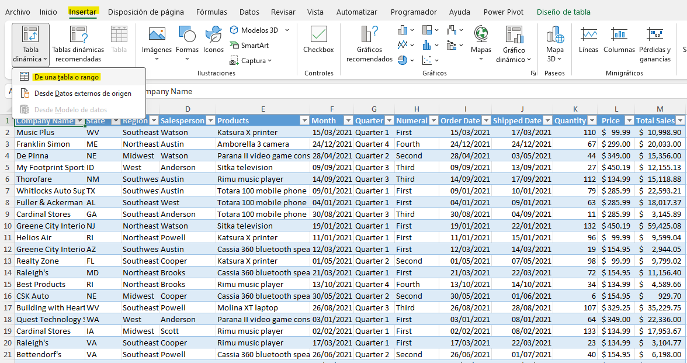
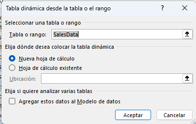
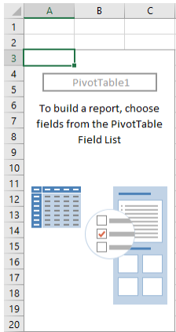
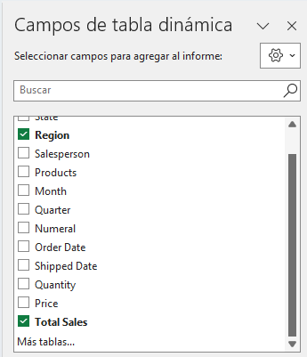
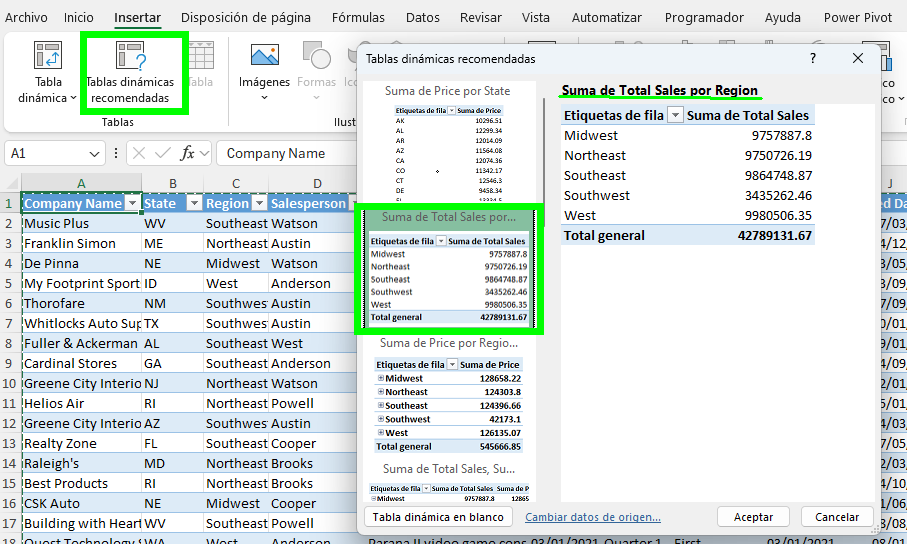
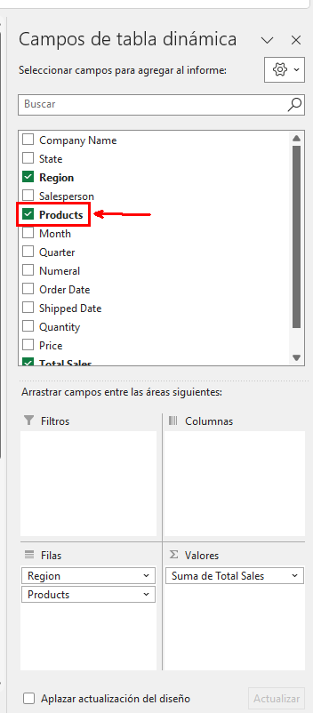
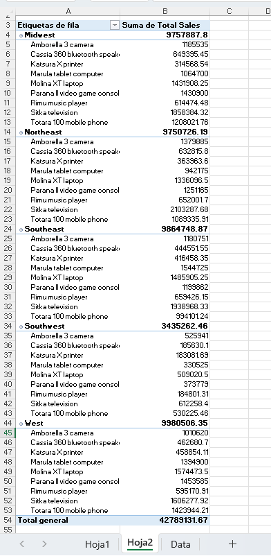

# Práctica 5.1. Crear una Tabla Dinámica.

## Objetivo de la práctica:

Al finalizar la práctica, serás capaz de:

- Crear y modificar tablas dinámicas en Excel, incluyendo la personalización de los informes para mostrar datos específicos como ventas totales por productos y regiones.

## Duración aproximada:
- 10 minutos.

## Instrucciones:

### Escenario:

Como gerente de ventas, necesitas realizar un seguimiento de las ventas. Debido a que los productos de Develetech se venden en muchas regiones, deseas poder analizar los datos de ventas de varias maneras. Decides que la mejor manera de responder a tus preguntas ahora y en el futuro es crear una tabla dinámica.

### Antes de empezar:

Abre el siguiente archivo: [Sales Data](<Sales Data.xlsx>).

### Tarea 1. Crea una tabla dinámica a partir de los datos.

**Paso 1.** Asegúrate de que la celda A1 esté seleccionada.

**Paso 2.**  Selecciona _Insertar > Tabla Dinámica_.

**Paso 3.** En la sección _Elige los datos que deseas analizar_, verifica que la opción _Seleccionar una tabla o rango_ esté seleccionada.

**Paso 4.** En la sección _Elige dónde deseas colocar el informe de la tabla dinámica_, verifica que la opción _Nueva hoja_ de trabajo esté seleccionada y da clic en **Aceptar**.

**Paso 5.** Observa que el marco de la tabla dinámica se crea en una nueva hoja de trabajo.

### Tarea 2. Construye el informe de la tabla dinámica.

**Paso 1.** En el panel de tareas de _Campos de tabla dinámica_, en la sección _Elegir campos para agregar al informe_, marca las casillas de verificación para _Región_ y _Ventas totales_.

**Notas:** 

- Verifica que Excel construye una tabla dinámica en Hoja1 que muestra la suma de las ventas totales para cada región.  
- Observa que Excel no conserva el formato de celda de los datos originales al crear informes de tabla dinámica.

### Tarea 3. Crear una tabla dinámica recomendada a partir de los datos de ventas.

**Paso 1.** Selecciona la hoja de trabajo _Datos_ y verifica que la celda **A1** esté seleccionada.

**Paso 2.**  Selecciona _Insertar > Tablas Dinámicas Recomendadas_.

**Paso 3.** Examina las diversas opciones de tabla dinámica en el cuadro de diálogo _Tablas Dinámicas Recomendadas_. Selecciona la segunda variante, _Suma de Ventas Totales por Región_, y da clic en **Aceptar**.

**Paso 4.**  Verifica que *Hoja2* contenga la nueva tabla dinámica.

**Nota:** Esta acción construye el mismo informe de tabla dinámica en Hoja2 que el primer informe de tabla dinámica en Hoja1. Las tablas dinámicas recomendadas son una buena manera de comenzar a construir tus propios informes de tabla dinámica.

### Tarea 4. Modificar la tabla dinámica en Hoja2 para incluir productos.

**Paso 1.** En el panel de tareas _Campos de Tabla Dinámica_, en la sección _Elegir campos_ para agregar al informe, selecciona **Productos**.

**Nota:** Verifica que la tabla dinámica se actualiza para incluir las ventas totales de productos en cada región.

**Paso 2.** Guarda los cambios realizados en el archivo y mantenlo abierto.

### Resultado esperado:

## [Menú principal](../README.md)

## [Práctica 4.3. Modificar y formatear gráficos.](../Capítulo4/README_4.3.md)

## [Práctica 5.2. Analizando los datos de la tabla dinámica.](../Capítulo5/README_5.2.md)

