# Analizando los datos de la tabla dinámica 

## Objetivo de la práctica:
- Modificar informes de tablas dinámicas para extraer y analizar datos específicos, como ventas por trimestre y región.

- Aplicar filtros y personalizar la visualización de datos en tablas dinámicas.

- Formatear datos en una tabla dinámica utilizando opciones de configuración de campos de valor.

- Ordenar datos en una tabla dinámica para identificar tendencias y patrones de ventas.

## Duración aproximada:
-  15 minutos.

## Instrucciones 

### Antes de comenzar
El libro de trabajo My Sales Data.xlsx está abierto.
### Escenario

Estás satisfecho con los informes de la tabla dinámica que has creado. Ahora deseas ver qué otra información puedes extraer de la tabla dinámica. Decides ver si puedes responder las siguientes preguntas:

- ¿Cuáles son las ventas del cuarto trimestre?
- ¿Cuáles son las ventas totales para cada trimestre por región?
- ¿Cuáles son las ventas totales para cada región por producto?

### Tarea 1. Modifica el informe de la tabla dinámica en Hoja1 para responder a la pregunta: "¿Cuáles son los valores de ventas del cuarto trimestre?"

Paso 1.Selecciona Hoja 1 y verifica que la tabla dinámica está seleccionada.

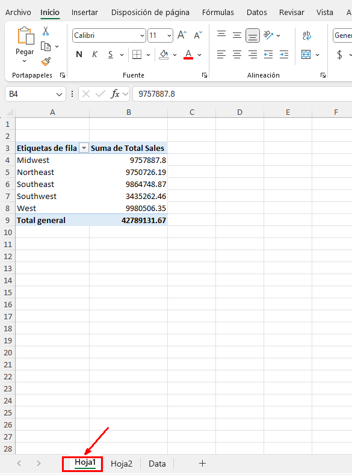

Paso 2. En el panel de tareas Campos de la tabla dinámica, en la opción Mostrar, seleeciona _Lista de campos_, arrastra y suelta el campo _Trimestre_ _(Quarter)_ en el área de Filtros. Verifica que Trimestre está en la celda *A1* y que hay un filtro en la celda *B1.*

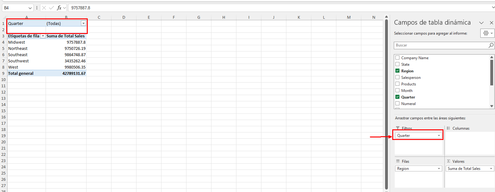

Paso 3. Selecciona la flecha desplegable en la celda B1, selecciona Cuarto Trimestre y luego selecciona OK.
Verifica que las ventas totales del cuarto trimestre son _10025418._

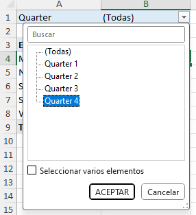

### Tarea 2. Elimina el filtro de Trimestre y modifica el informe de la tabla dinámica para responder a la pregunta: "¿Cuáles son las ventas totales por región para cada trimestre?"

Paso 1. Selecciona la flecha desplegable de _AutoFiltro_ en la celda *B1*, selecciona Seleccionar _todo_ y luego selecciona OK.

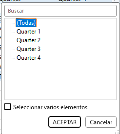

Paso 2.  En el panel de tareas Campos de la tabla dinámica, en la sección Arrastrar campos entre las áreas a continuación, arrastra y suelta Trimestre desde el área de Filtros al área de Columnas.
Verifica que el informe de la tabla dinámica se actualiza para mostrarte las ventas totales para cada región por trimestre.

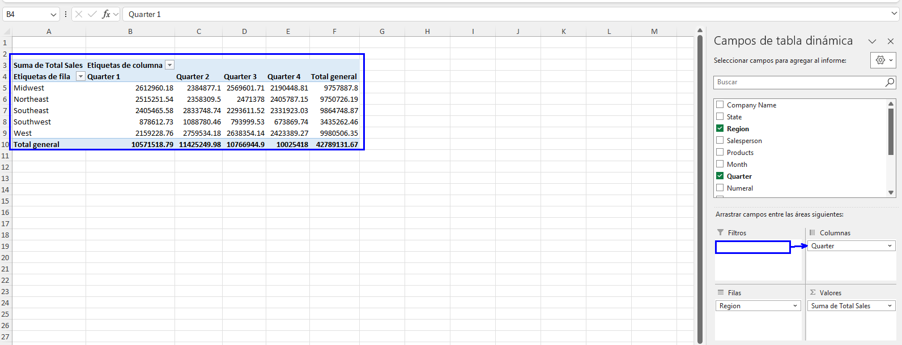

### Tarea 3. Modifica la tabla dinámica en Hoja 2 para responder a la pregunta: "¿Cuáles son las ventas totales para cada región por producto?"

Paso 1. Selecciona _Hoja 2_ y verifica que la Tabla dinámica está seleccionada.

Paso 2. En el panel de tareas Campos de la tabla dinámica, en la sección Arrastrar campos entre las áreas a continuación, arrastra y suelta _Productos_ desde el área de Filas al área de _Columnas._
Verifica que el informe de la tabla dinámica se actualiza para mostrarte las ventas regionales para cada producto.

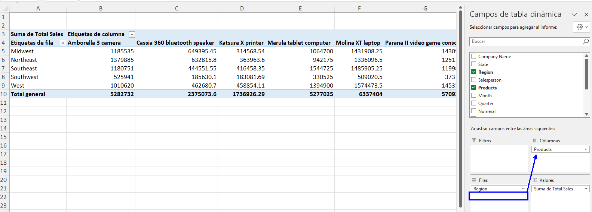

### Tarea 4. Modifica el formato del informe de la tabla dinámica.

Paso 1.  En el panel de tareas Campos de la tabla dinámica, en la sección Arrastrar campos entre las áreas a continuación, en el área _Valores_, selecciona la flecha desplegable de _Suma de ventas totales_ y selecciona Configuración de campo de valor.

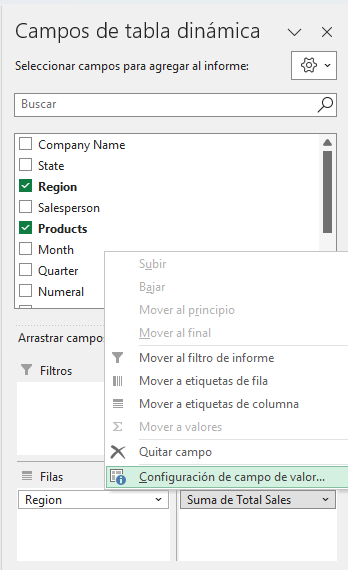

Paso 2.  En el cuadro de diálogo Configuración de campo de valor, selecciona el botón _Formato de número._

Paso 3.  En el cuadro de diálogo Formato de celdas, en la lista de categorías, selecciona Moneda.

Paso 4. En el cuadro de Posiciones decimales, escribe 0 y luego selecciona OK.

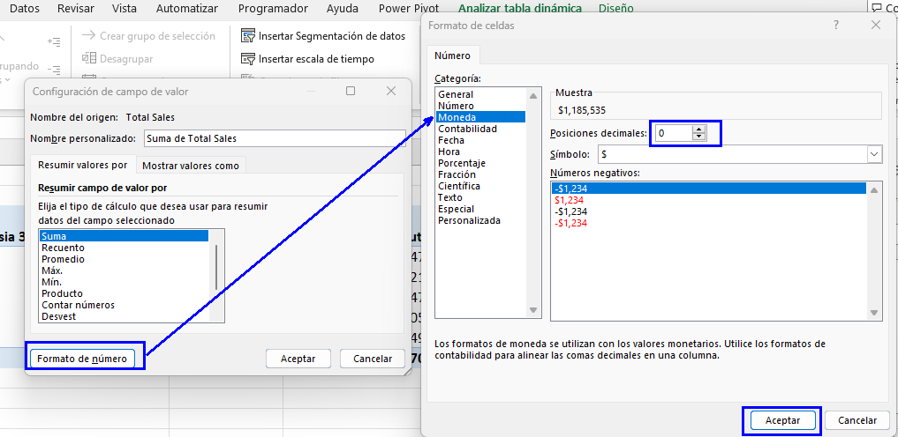

Paso 5. En el cuadro de diálogo Configuración de campo de valor, selecciona OK para guardar la configuración del campo de valor.

Verifica que la tabla dinámica ha actualizado los valores totales de ventas con el formato de moneda.

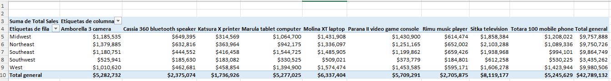

### Tarea 5. Ordena los valores de Total general de menor a mayor.

Paso 1. Selecciona uno de los valores de Total general en la columna K.

Paso 2.  Selecciona _Inicio → Ordenar y filtrar → Ordenar de menor a mayor._
Verifica que los totales generales estén ordenados de menor a mayor.

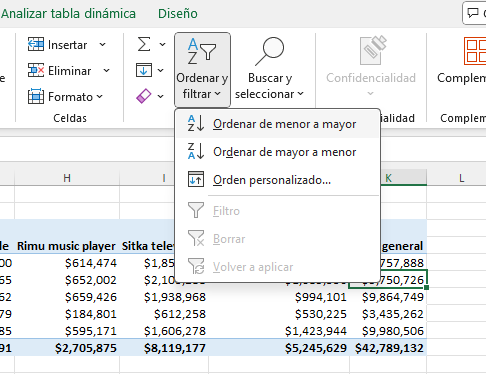

Paso 3. Guarda el libro de trabajo y mantén el archivo abierto.

### Resultado esperado
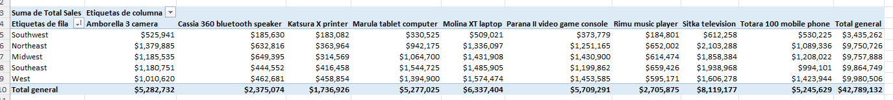
