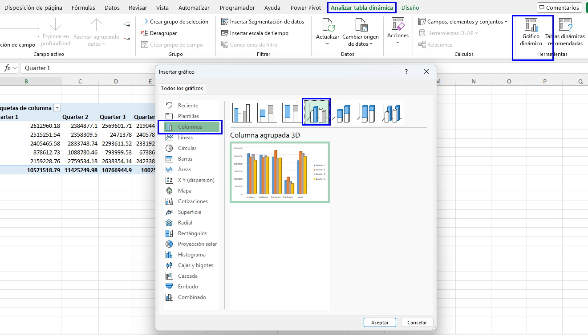
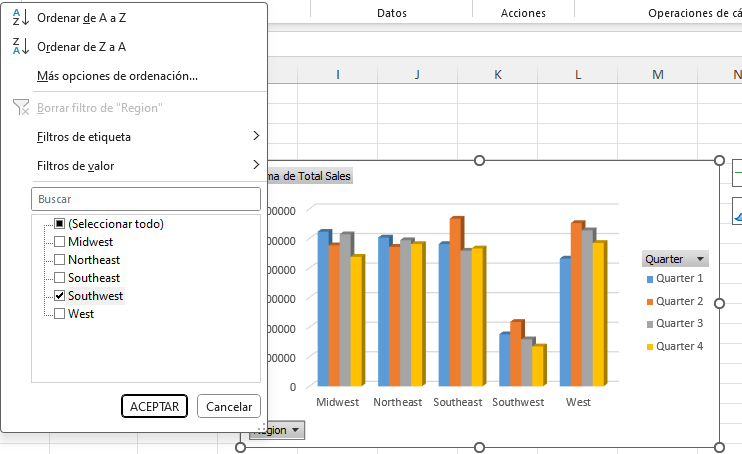
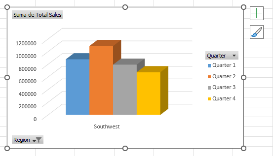
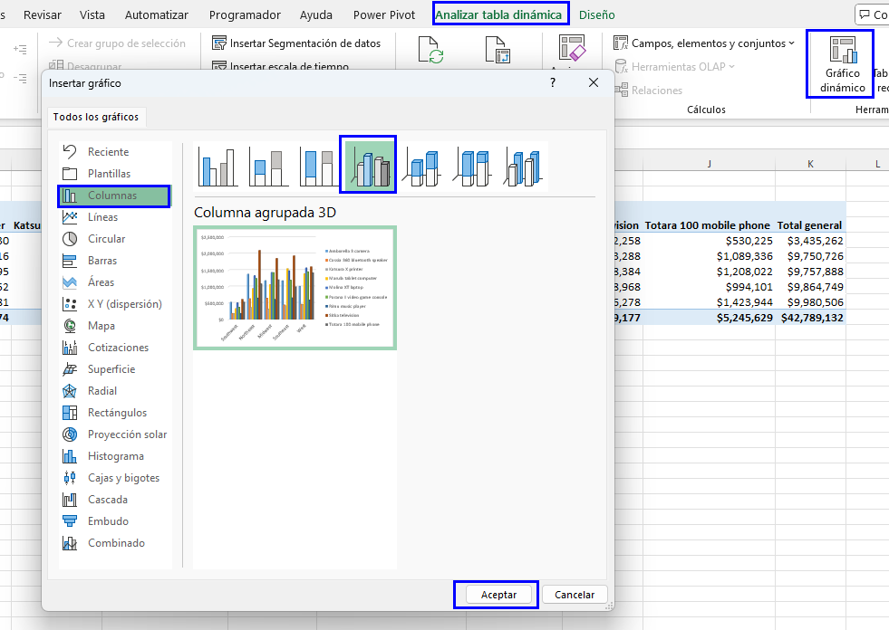
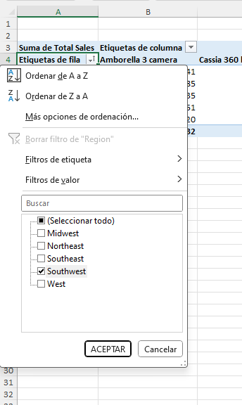
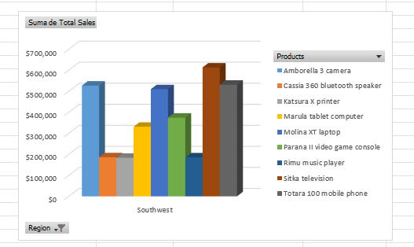
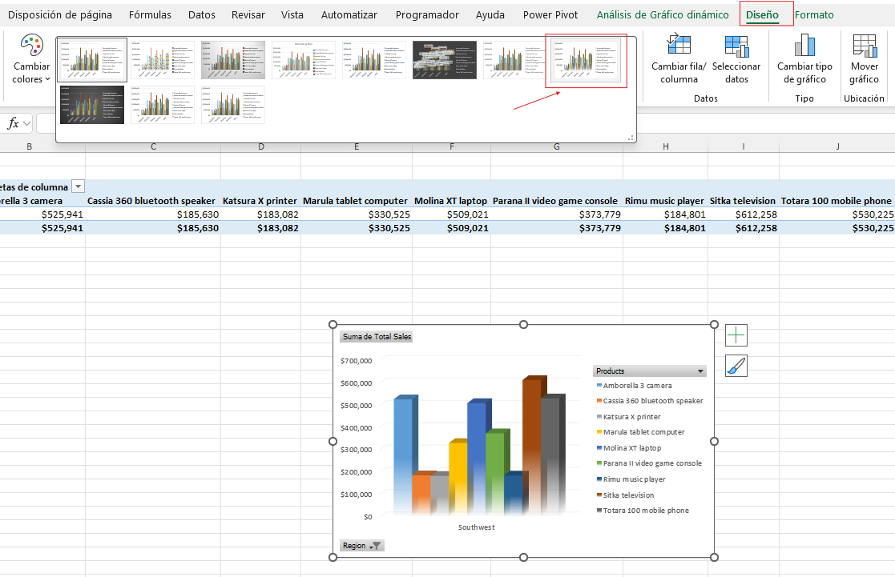
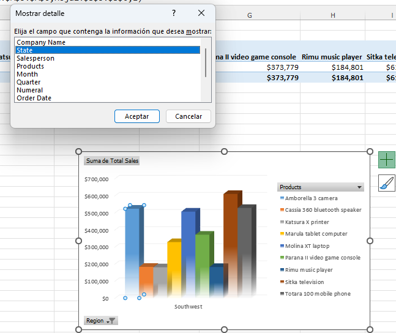
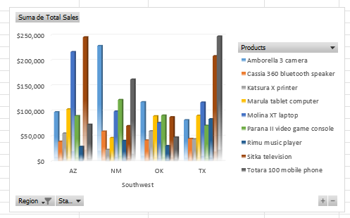

# Práctica 5.3. Presentación de datos con gráficos dinámicos.

## Objetivo de la práctica:

Al finalizar la práctica serás capaz de:

- Crear gráficos dinámicos (PivotCharts) a partir de tablas dinámicas (PivotTables) para representar visualmente datos complejos.  
- Personalizar y modificar el diseño de gráficos dinámicos para mejorar la visualización de datos.  
- Aplicar y ajustar filtros en gráficos dinámicos y tablas dinámicas para analizar datos específicos, como ventas por región o producto.  
- Examinar en detalle las ventas por región utilizando la función de mostrar detalles en gráficos dinámicos.  
- Interpretar y analizar las variaciones de ventas a través de gráficos dinámicos para apoyar la toma de decisiones informadas.

## Duración aproximada:
- 15 minutos.

## Instrucciones:

### Antes de comenzar:

Asegúrate de que el libro de trabajo _My Sales Data.xlsx: esté abierto.

### Escenario:

Estás satisfecho con las modificaciones que realizaste en los informes de tablas dinámicas que creaste. Sin embargo, sabes que cuando presentes estos datos a la dirección, preferirán ver una representación visual. Por ello, decides crear un gráfico dinámico (PivotChart) a partir de uno de tus informes de tablas dinámicas.

### Tarea 1. Crear un gráfico dinámico (PivotChart) a partir de la tabla dinámica en _Hoja 1_.

**Paso 1.** Selecciona la **Hoja1** y verifica que la tabla dinámica esté seleccionada.

**Paso 2.** En la pestaña contextual _Analizar tabla dinámica_, selecciona _Gráfico dinámico (PivotChart)_.

**Paso 3.** En el cuadro de diálogo _Insertar gráfico_, asegúrate de que la categoría **Gráfico de columnas** esté seleccionada. Después, elige el cuarto sub-tipo, **Columna agrupada en 3D** (3-D Clustered Column), y haz clic en **OK**.

### Tarea 2. Examinar la región suroeste (southwest), ya que se puede visualizar que las ventas totales en esta región son más bajas que en otras regiones.

**Paso 1.** En el Gráfico dinámico (PivotChart), selecciona la flecha desplegable del botón de campo _Región_ y desmarca **Seleccionar todo**. Luego, elige Suroeste (Southwest) y da clic en **OK**.

**Paso 2.** Observa que hay una disminución en las ventas después del segundo trimestre en la región suroeste.

**Nota:** Cuando se aplica un filtro a un Gráfico dinámico (PivotChart), este mismo se aplica a la Tabla dinámica (PivotTable).

### Tarea 3. Crear un gráfico dinámico (PivotChart) para la tabla dinámica en _Hoja2_.

**Paso 1.** Selecciona la _Hoja2_ y verifica que la tabla dinámica está seleccionada.

**Paso 2.** En la pestaña contextual _Analizar tabla dinámica_, selecciona **Gráfico dinámico** (PivotChart).

**Paso 3.** En el cuadro de diálogo _Insertar gráfico_, verifica que la categoría _Gráfico de columnas_ esté seleccionada. Posteriormente, elige el cuarto sub-tipo, _Columna agrupada en 3D_ (3-D Clustered Column), y da clic en **OK**.

**Paso 4.** Mueve el gráfico dinámico (PivotChart) debajo de la tabla dinámica, según sea necesario.

### Tarea 4. Examinar las ventas de productos para la región suroeste.

**Paso 1.** En la celda **A4** de la tabla dinámica, selecciona la flecha desplegable de _AutoFiltro_ de etiquetas de fila (Row Labels AutoFilter) y desmarca **Seleccionar todo** (Select All). Después, elige _Suroeste_ (Southwest) y da clic en **OK**.

### Tarea 5. Modificar el diseño del gráfico dinámico (PivotChart) en _Sheet1_ para explorar más detalles de la región suroeste.

**Paso 1.** Dirígete la _Hoja1_ y selecciona el gráfico dinámico (PivotChart), si es necesario.

**Paso 2.** En la pestaña contextual Diseño (Design), selecciona **Estilo 8** (Style 8).

**Nota:** Es posible que debas seleccionar el botón **Más** (More) en la galería de estilos de gráficos (Chart Styles).

**Paso 3.** Haz doble clic en cualquier columna del gráfico dinámico (PivotChart).

**Paso 4.** En el cuadro de diálogo _Mostrar detalles_ (Show Detail), selecciona **Estado** (State) y haz clic en **OK**.

**Paso 5.** Observa que el gráfico dinámico (PivotChart) y la tabla dinámica (PivotTable) se actualizan con los estados en la región suroeste.

**Paso 6.** Guarda los cambios realizados y conserva el libro abierto.

### Resultado esperado:

## [Menú principal](../README.md)

## [Práctica 5.2. Analizando los datos de la tabla dinámica.](../Capítulo5/README_5.2.md)

## [Práctica 5.4. Filtrar datos utilizando segmentaciones (Slicers) y líneas de tiempo 
