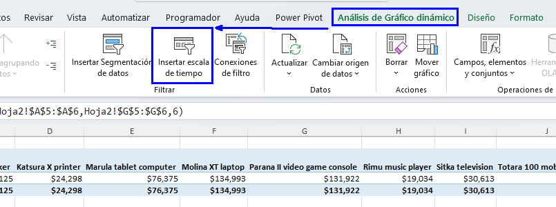
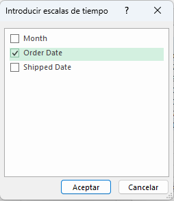
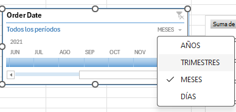
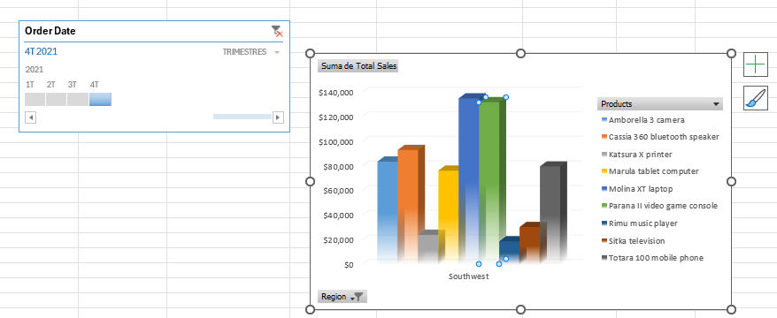
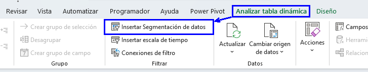
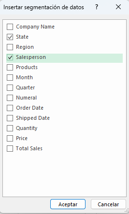
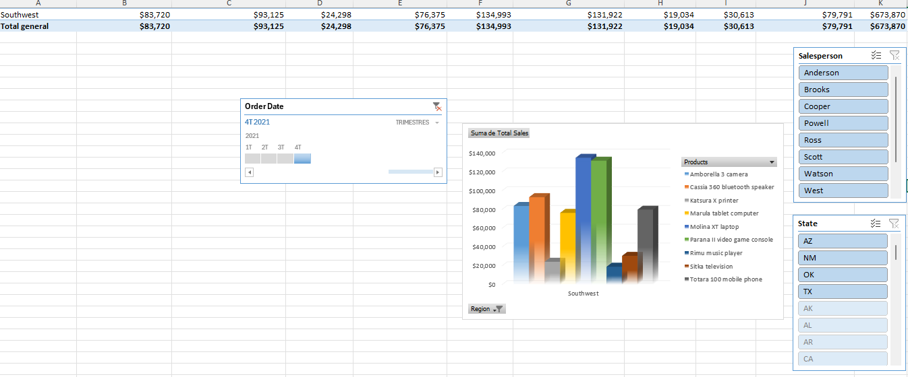
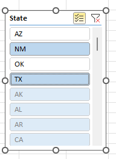
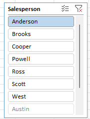
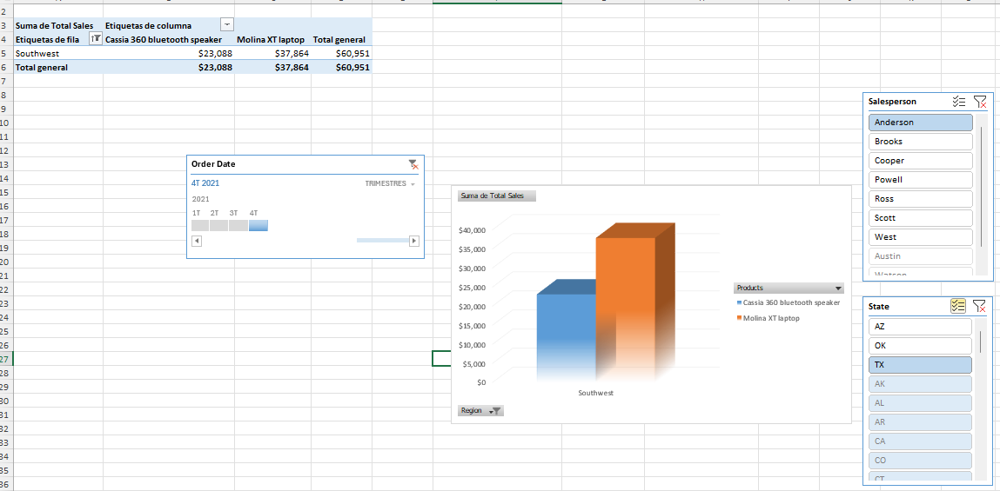

# Filtrar datos utilizando segmentaciones (Slicers) y líneas de tiempo (Timelines)

## Objetivo de la práctica:
Al finalizar la práctica, serás capaz de:
- Utilizar líneas de tiempo (Timelines) en tablas dinámicas y gráficos dinámicos para filtrar y visualizar datos específicos, como las ventas del cuarto trimestre en una región determinada.

- Insertar y personalizar segmentaciones (Slicers) para filtrar tablas dinámicas y gráficos dinámicos, permitiendo un análisis más detallado de los datos.

- Aplicar filtros combinados utilizando segmentaciones múltiples para analizar ventas en diferentes estados y por diferentes vendedores.

- Interpretar los resultados filtrados para identificar tendencias y patrones, como la distribución de ventas en regiones específicas y el rendimiento de vendedores particulares.

## Duración aproximada:
- 15 minutos.

## Instrucciones 

### Antes de comenzar
El libro de trabajo My Sales Data.xlsx está abierto. 

### Escenario
Estás satisfecho con las modificaciones que has hecho en los informes de tablas dinámicas y los nuevos gráficos dinámicos que has creado. Te das cuenta de que las preguntas iniciales que formulaste para analizar tus datos eran desde tu propia perspectiva. Para hacer que las tablas dinámicas y los gráficos dinámicos sean más flexibles, decides crear una línea de tiempo e insertar segmentaciones. Esto te permitirá a ti y a cualquier otra persona ver los datos de ventas de muchas maneras.

### Tarea 1. Inserta una línea de tiempo para ver los valores de ventas del cuarto trimestre para la región suroeste.

Paso 1. Selecciona la hoja de trabajo _Hoja2_ y mueve el gráfico dinámico para ver claramente la tabla dinámica, si es necesario. Da doble clic a una barra del gráfico y en los campos de la tabla dinámica desmarca _State_

Paso 2. Selecciona la Tabla dinámica (PivotTable) y, en la pestaña contextual _Analizar tabla dinámica_, selecciona _Insertar escala de tiempo_.

Paso 3. En el cuadro de diálogo Insertar líneas de tiempo (Insert Timelines), selecciona Fecha de pedido (Order Date) y selecciona OK.

Paso 4. Mueve la línea de tiempo para ver claramente todos los objetos de la hoja de trabajo, si es necesario.

Paso 5. Selecciona la flecha desplegable del Nivel de tiempo (Time Level) y selecciona TRIMESTRES (QUARTERS).

Paso 6.  Selecciona Q4 de 2021 y verifica que tanto la tabla dinámica como el gráfico dinámico se actualicen para mostrar solo los valores del cuarto trimestre.

### Tarea 2. Inserta segmentaciones (slicers) para filtrar la tabla dinámica (PivotTable) y el gráfico dinámico (PivotChart).

Paso 1. Selecciona la Tabla dinámica (PivotTable), si es necesario, y en la pestaña contextual Analizar tabla dinámica (PivotTable Analyze), selecciona Insertar segmentación (Insert Slicer).

Paso 3. En el cuadro de diálogo Insertar segmentación (Insert Slicer), marca Estado (State) y Vendedor (Salesperson), y luego selecciona OK.

Paso 4. Mueve las segmentaciones de Vendedor (Salesperson) y Estado (State) según sea necesario para ver claramente todos los objetos de la hoja de trabajo.

### Tarea 3. Usando las segmentaciones, filtra las ventas en Nuevo México y Texas para el vendedor Anderson.

Paso 1. En la segmentación de Estado (State), selecciona Selección múltiple (Multi-Select).

Paso 2. Selecciona AZ y OK para desactivar esos estados.

Paso 3. En la segmentación de Vendedor (Salesperson), selecciona Anderson.

Verifica que la tabla dinámica (PivotTable) y el gráfico dinámico (PivotChart) se actualicen para mostrar las ventas totales de Anderson en Texas (TX) en el cuarto trimestre (Q4), observando que Anderson no tiene ventas en Nuevo México (NM).

### Resultado esperado

