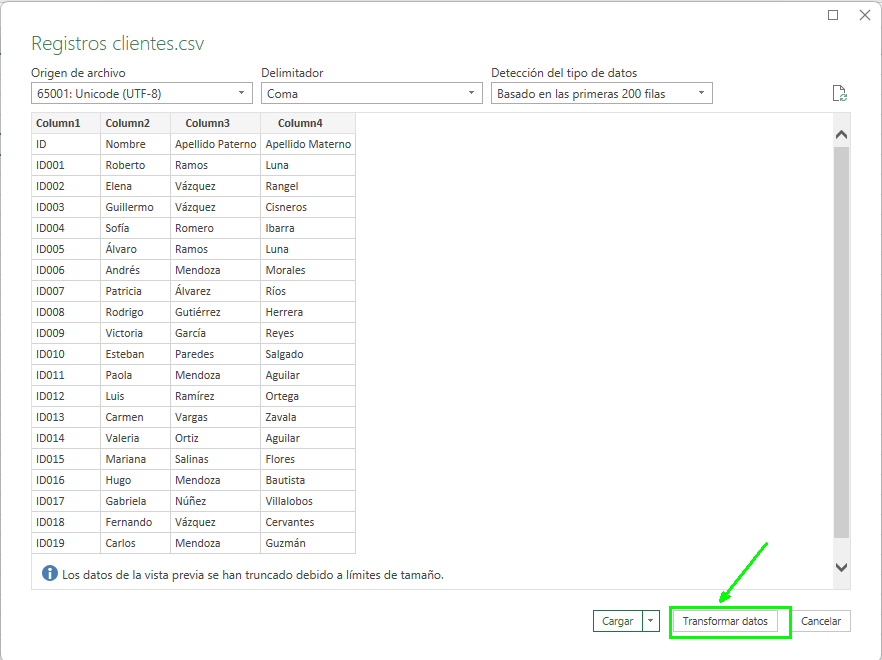
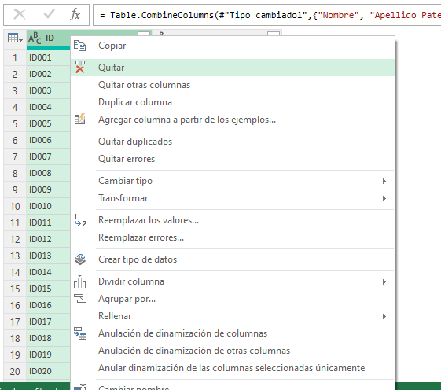

# Consolidación de Ventas

## Objetivo de la práctica:
Al finalizar la práctica, serás capaz de:
- Automatizar la consolidación de archivos de ventas individuales en un solo archivo centralizado.

- Permitir futuras actualizaciones automáticas, de manera que cuando Lucas, María o Marco añadan nuevas ventas a sus archivos, el archivo consolidado se actualice con facilidad.

## Duración aproximada:
- 15 minutos.

## Escenario

En una empresa de distribución, Lucas, María y Marco son responsables de diferentes regiones de ventas. Cada uno lleva un archivo de Excel donde registra sus ventas mensuales, especificando el nombre del cliente, la ciudad, el producto, la cantidad y el monto total. Sin embargo, la gerencia necesita consolidar esta información en un solo archivo para analizar las ventas globales y tomar decisiones estratégicas.

El equipo quiere automatizar este proceso para ahorrar tiempo y evitar errores manuales, utilizando Power Query para consolidar los datos de ventas de Lucas, María y Marco en un solo archivo maestro.

## Instrucciones 

### Tarea 1.  Preparar los archivos individuales
Paso 1. Descarga los siguientes archivos que traen los datos de ventas de María, Lucas y Marco

[Ventas Lucas](<Ventas Lucas.xlsx>)

[Ventas Marco](<Ventas Marco.xlsx>)

[Ventas Maria](<Ventas Maria.xlsx>)

Y guardalos en una carpeta que diga: _VENTAS 2023_

### Tarea 2. Importar los datos con Power Query
Paso 1. Abre un libro nuevo de excel y nombralo: *CONSOLIDADO*

Paso 2. Ve a la pestaña de *Datos > Obtener datos > Desde archivo > Desde carpeta.*

Paso 3. Selecciona la carpeta donde están almacenados los archivos de ventas de Lucas, María y Marco.

Paso 4. Power Query te mostrará una vista previa de los archivos disponibles.

Paso 5. Da clic en la parte de abajo donde dice combinar y selecciona *Combinar y transformar*

Paso 6. Ve a la opcion de *Archivo de ejemplo* y selecciona algun archivo de los vendedores y en opciones de presentación selecciona la Hoja 1, haz lo mismo con todos los archivos de cada vendedor.

Paso 7. Una vez que termines, selecciona Aceptar y se abrirá el editor de Power Query 

### Tarea 3. Cargar los datos consolidados:

Una vez que hayas consolidado y limpiado los datos, selecciona Cerrar y Cargar para cargar la tabla consolidada en una nueva hoja de Excel.

### Resultado esperado
En esta sección se debe mostrar el resultado esperado de nuestro laboratorio

### Tarea Extra. Agregar un nuevos datos

Paso 1. Ve al archivo de Ventas María y agrega un nuevo registro 

Paso 2. Guarda los cambio y cierra el archivo

Pao 3. Regresa al archivo CONSOLIDADO, ve a cualquier casilla de la tabla y en el menú veras la opción *Consulta -> Actualizar *

### Resultado esperado
Veras como se actualiza el consolidado con tu nuevo registro.

# Unificación de Nombres en una Celda utilizando Power Query

## Objetivo de la práctica:
Al finalizar la práctica, serás capaz de:

- Aprender a utilizar Power Query para combinar columnas de texto en una sola celda y formatear los datos de manera eficiente. En este caso, unificar los campos de Nombre, Apellido Paterno y Apellido Materno en una nueva columna denominada Nombre Completo.

## Duración aproximada:
- 10 minutos.

## Escenario
Tienes una base de datos de clientes con los campos separados en Nombre, Apellido Paterno y Apellido Materno en distintas columnas. Sin embargo, para algunos informes, necesitas tener el nombre completo de cada cliente en una sola celda. En lugar de hacerlo manualmente, vas a utilizar Power Query para automatizar el proceso y unir estos campos en una columna denominada Nombre Completo.

Esta tarea es común cuando se tiene que preparar una lista de correos electrónicos, un informe de clientes o datos para otros análisis, donde se necesita mostrar el nombre completo de las personas.

### Tarea 1. Cargar los datos

Paso 1. Descarga y guarda el archivo llamado: [Registros clientes](<Registros clientes.csv>) que está en formato csv.

verás las columnas separadas de Nombre, Apellido Paterno y Apellido Materno.

Paso 2. Ve a la pestaña Datos > Obtener datos > Desde archivo > De texto/CSV.

Paso 3. Selecciona el archivo  llamado *Registro Clientes* que contiene los nombres, apellidos paternos y maternos.

Paso 4. En el panel de Navegador, selecciona la tabla que contiene estos datos y haz clic en Transformar datos para abrir el editor de Power Query.

### Tarea 2. Combinar columnas

Paso 1. En el editor de Power Query dar clic en el cuadro izquierdo que aparece a lado de la Column1 y seleccionar la opción de usar la primera fila como encabezado.

Paso 2. Selecciona las 3 columnas que traen información del nombre y los apellidos 

Paso 3. Da clic derecho y selecciona la opcion combinar columnas 

Paso 4. Escobe como separador la opción de espacio y en Nuevo nombre columna escribe *Nombre completo*

Paso 5. Selecciona la columa ID, da clic derecho y quitala.

Paso 6. Seleccionamos la columna *Nombre completo* , damos clic en *cerrar y cargar en*

Paso 7. Dejamos marcado la opción Tabla , marcamos la opción de Hoja de cálculo existente, seleccionamos la cela E1, clic en aceptar

Paso 8. Se tendrá la nueva columna de nombre completo, solo le damos el mismo formato que la tabla original. 

Paso 9. Guarda los cambios y cierra el archivo.

### Resultado esperado

# Cargar datos con Power BI

## Objetivo de la práctica:
Al finalizar la práctica, serás capaz de:
- Cargar datos a Power BI Desktop y crear un gráfico en Power BI.

## Duración aproximada:
- 15 minutos.

## Escenario
Imagina que te encuentras al borde de la jubilación y estás considerando mudarte a un lugar con abundante sol, bajos índices de delincuencia y acceso a servicios médicos de alta calidad, o quizás eres un analista de datos y quieres esa información para ayudar a tus clientes. Por ejemplo, tal vez quieras ayudar a su distribuidor de gafas de sol a promocionar sus ventas en los lugares donde hace sol con más frecuencia.

## Instrucciones

Utilizar el archivo llamado [Estados para la jubilación 2022](< Estados para la jubilación 2022.xlsx>)

### Tarea 1. Obtener datos

Paso 1. Dentro de la máquina virtual encontrarás instalado el Power BI Desktop, por favor inicia la aplicación.

Paso 2. Selecciona la pestaña Inicio de la cinta de opciones y luego selecciona Obtener datos > Libro de Excel.

### Resultado esperado

### Tarea 2.  Cargar datos

Paso 1. Ahora que hemos seleccionado la opción de *Libro de Excel* ya podemos realizar la carga de datos en Power BI Desktop, aparecerá una ventana donde podemos ver las opciones que tenemos para cargar los datos, Datos o Sheet1.

En este caso lo recomendable es utilizar la opción de Tabla ‘Datos’ con el fin de evitar un proceso de depuración que puede requerir al importar desde la hoja de Excel. Observa que al seleccionar cualquiera de las dos opciones, podrás tener una vista previa de los datos.

Selecciona la tabla ‘Datos’ y luego da clic en el botón amarillo que dice Cargar.

### Tarea 3. Analiza los datos con lo que dispones en la pestaña de datos

Paso 1. Ya que hemos realizado la carga de datos podemos analizar los datos en la pestaña de datos con el fin de hacer una primera impresión del tipo de datos, valores, categoría y formatos.

### Tarea 4. Crea un gráfico para el análisis de datos.

Ahora en la pestaña de informe, podemos realizar un análisis rápido de los datos con el fin de ver el “El promedio de puntaje según las regiones de Estados Unidos”, el gráfico que puede utilizar es un gráfico de columnas apiladas.

Paso 1. Regresa a la vista de informe y selecciona el segundo icono "Gráfico de columnas apiladas".

Paso 2. Del panel de Datos que se encuentra en el costado derecho, selecciona los campos: 
- Puntuación General
- Región

Da clic en la flecha hacia abajo que está en el elemento del Eje Y.
Selecciona promedio en la lista que aparece.

### Resultado esperado

