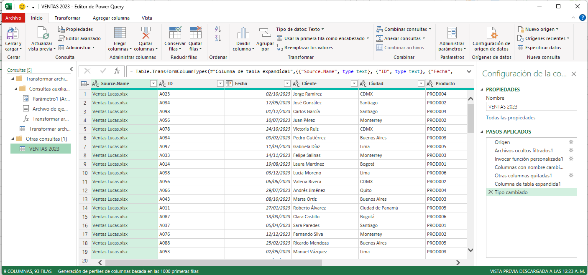

# Práctica 6.1. Consolidación de Ventas.

## Objetivo de la práctica:

Al finalizar la práctica, serás capaz de:

- Automatizar la consolidación de archivos de ventas individuales en un único archivo centralizado.  
- Permitir futuras actualizaciones automáticas, de manera que, cuando Lucas, María o Marco añadan nuevas ventas a sus archivos, el archivo consolidado se actualice con facilidad.  

## Duración aproximada:

- 15 minutos.

## Escenario:

En una empresa de distribución, Lucas, María y Marco son responsables de las ventas en diferentes regiones. Cada uno lleva un archivo de Excel en el que registra mensualmente sus ventas, especificando el nombre del cliente, la ciudad, el producto, la cantidad y el monto total. Sin embargo, la gerencia necesita consolidar esta información en un solo archivo para analizar las ventas globales y tomar decisiones estratégicas.

Para optimizar este proceso y reducir los errores manuales, el equipo ha decidido automatizar la consolidación de datos utilizando Power Query. Esto permitirá integrar de manera eficiente la información de ventas de Lucas, María y Marco en un archivo maestro.

## Instrucciones:

### Tarea 1. Preparar los archivos individuales.

**Paso 1.** Descarga los siguientes archivos, los cuales contienen los datos de ventas de María, Lucas y Marco.

[Ventas Lucas](<Ventas Lucas.xlsx>)

[Ventas Marco](<Ventas Marco.xlsx>)

[Ventas Maria](<Ventas Maria.xlsx>)

Posteriormente, guárdalos en una carpeta con el nombre: _VENTAS 2023_.

### Tarea 2. Importar los datos con Power Query.

**Paso 1.** Abre un libro nuevo de Excel y nómbralo: *CONSOLIDADO*.

**Paso 2.** Dirígete a la pestaña de *Datos > Obtener datos > Desde archivo > Desde carpeta*.

**Paso 3.** Selecciona la carpeta donde están almacenados los archivos de ventas de Lucas, María y Marco.

**Paso 4.** Power Query mostrará una vista previa de los archivos disponibles.

**Paso 5.** En la parte inferior, da clic en **Combinar** y selecciona *Combinar y transformar*.

**Paso 6.** Dirígete a la opción de *Archivo de ejemplo*, selecciona algún archivo de los vendedores y, en opciones de presentación, selecciona la _Hoja 1_. Posteriormente, realiza lo mismo con cada uno de los archivos de cada vendedor.

**Paso 7.** Una vez que finalices, selecciona **Aceptar**. De esta forma, se abrirá el editor de Power Query.

### Tarea 3. Cargar los datos consolidados.

Una vez que hayas consolidado y limpiado los datos, selecciona **Cerrar y cargar** para cargar la tabla consolidada en una nueva hoja de Excel.

### Resultado esperado:

### Tarea adicional: Agregar un nuevos datos.

**Paso 1.** Dirígete al archivo de _Ventas María_ y agrega un nuevo registro.

**Paso 2.** Guarda los cambio y cierra el archivo.

**Paso 3.** Regresa al archivo _CONSOLIDADO_, dirígete a cualquier casilla de la tabla y, en el menú, podrás visualizar la opción *Consulta > Actualizar*.

### Resultado esperado:

Como resultado, podrás observar cómo se actualiza el consolidado con tu nuevo registro.

## [Menú principal](../README.md)

## [Práctica 5.4. Filtrar datos utilizando segmentaciones (Slicers) y líneas de tiempo (Timelines).](../Capítulo5/README_5.4.md)

## [Práctica 6.2. Unificación de nombres en una celda utilizando Power Query.](../Capítulo6/README_6.2.md)
