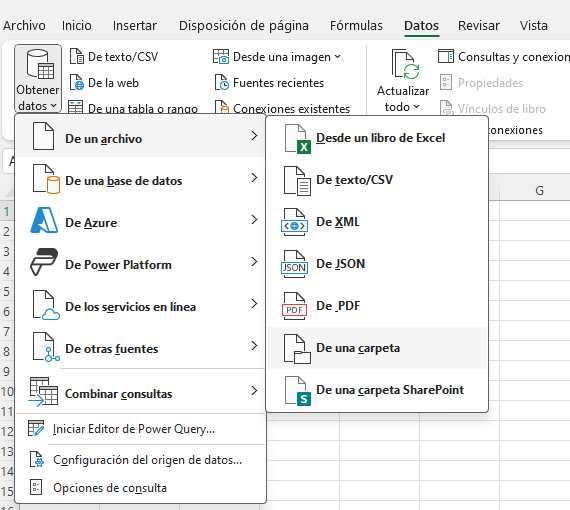
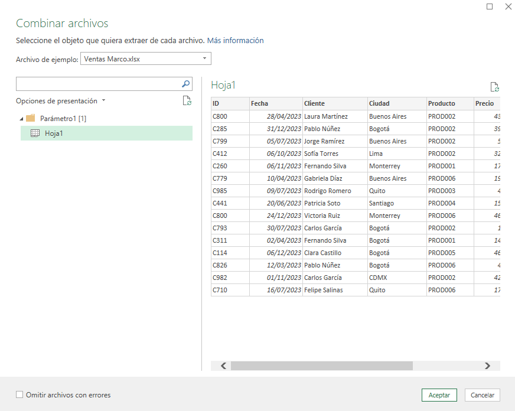
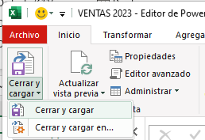
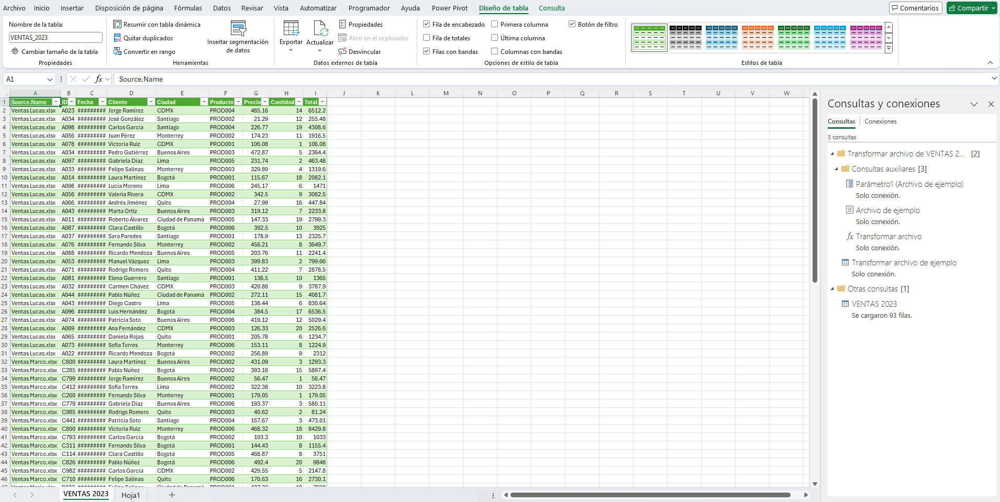

# Práctica 6.1. Consolidación de Ventas.

## Objetivo de la práctica:
Al finalizar la práctica, serás capaz de:
- Automatizar la consolidación de archivos de ventas individuales en un solo archivo centralizado.

- Permitir futuras actualizaciones automáticas, de manera que cuando Lucas, María o Marco añadan nuevas ventas a sus archivos, el archivo consolidado se actualice con facilidad.

## Duración aproximada:
- 15 minutos.

## Escenario

En una empresa de distribución, Lucas, María y Marco son responsables de diferentes regiones de ventas. Cada uno lleva un archivo de Excel donde registra sus ventas mensuales, especificando el nombre del cliente, la ciudad, el producto, la cantidad y el monto total. Sin embargo, la gerencia necesita consolidar esta información en un solo archivo para analizar las ventas globales y tomar decisiones estratégicas.

El equipo quiere automatizar este proceso para ahorrar tiempo y evitar errores manuales, utilizando Power Query para consolidar los datos de ventas de Lucas, María y Marco en un solo archivo maestro.

## Instrucciones 

### Tarea 1.  Preparar los archivos individuales
Paso 1. Descarga los siguientes archivos que traen los datos de ventas de María, Lucas y Marco

[Ventas Lucas](<Ventas Lucas.xlsx>)

[Ventas Marco](<Ventas Marco.xlsx>)

[Ventas Maria](<Ventas Maria.xlsx>)

Y guardalos en una carpeta que diga: _VENTAS 2023_

### Tarea 2. Importar los datos con Power Query
Paso 1. Abre un libro nuevo de excel y nombralo: *CONSOLIDADO*

Paso 2. Ve a la pestaña de *Datos > Obtener datos > Desde archivo > Desde carpeta.*

Paso 3. Selecciona la carpeta donde están almacenados los archivos de ventas de Lucas, María y Marco.

Paso 4. Power Query te mostrará una vista previa de los archivos disponibles.

Paso 5. Da clic en la parte de abajo donde dice combinar y selecciona *Combinar y transformar*

Paso 6. Ve a la opcion de *Archivo de ejemplo* y selecciona algun archivo de los vendedores y en opciones de presentación selecciona la Hoja 1, haz lo mismo con todos los archivos de cada vendedor.

Paso 7. Una vez que termines, selecciona Aceptar y se abrirá el editor de Power Query 

### Tarea 3. Cargar los datos consolidados:

Una vez que hayas consolidado y limpiado los datos, selecciona Cerrar y Cargar para cargar la tabla consolidada en una nueva hoja de Excel.

### Resultado esperado
En esta sección se debe mostrar el resultado esperado de nuestro laboratorio

### Tarea Extra. Agregar un nuevos datos

Paso 1. Ve al archivo de Ventas María y agrega un nuevo registro 

Paso 2. Guarda los cambio y cierra el archivo

Pao 3. Regresa al archivo CONSOLIDADO, ve a cualquier casilla de la tabla y en el menú veras la opción *Consulta -> Actualizar *

### Resultado esperado
Veras como se actualiza el consolidado con tu nuevo registro.

