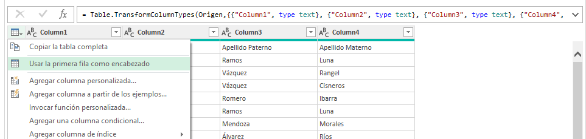
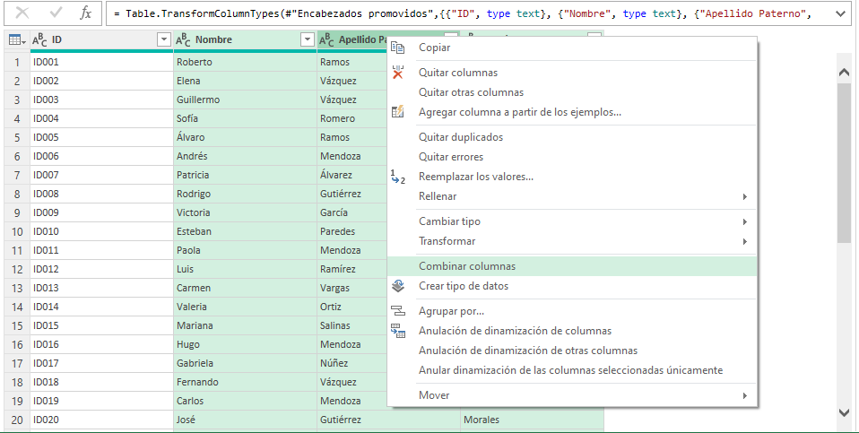

# Práctica 6.2. Unificación de nombres en una celda utilizando Power Query.

## Objetivo de la práctica:

Al finalizar la práctica, serás capaz de:

- Aprender a utilizar Power Query para combinar columnas de texto en una sola celda y formatear los datos de manera eficiente. En este caso, unificar los campos de Nombre, Apellido Paterno y Apellido Materno en una nueva columna denominada _Nombre Completo_.

## Duración aproximada:

- 10 minutos.

## Escenario:

Tienes una base de datos de clientes donde los campos Nombre, Apellido Paterno y Apellido Materno están separados en distintas columnas. Sin embargo, para algunos informes, necesitas consolidar el nombre completo de cada cliente en una sola celda. En lugar de hacerlo manualmente, utilizarás Power Query para automatizar este proceso, combinando estos campos en una nueva columna llamada Nombre Completo.

Este procedimiento es útil en situaciones comunes, como la preparación de listas de correos electrónicos, informes de clientes o el análisis de datos, donde es necesario presentar el nombre completo de cada persona de manera clara y organizada.

### Tarea 1. Cargar los datos.

**Paso 1.** Descarga y guarda el siguiente archivo llamado: [Registros clientes](<Registros clientes.csv>), el cual está en formato csv.

Podrás observar las columnas separadas de _Nombre_, _Apellido Paterno_ y _Apellido Materno_.

**Paso 2.** Dirígete a la pestaña _Datos > Obtener datos > Desde archivo > De texto/CSV_.

**Paso 3.** Selecciona el archivo *Registro Clientes*, el cual contiene los nombres, apellidos paternos y maternos.

**Paso 4.** En el panel del Navegador, selecciona la tabla que contiene estos datos y haz clic en **Transformar datos** para abrir el editor de Power Query.

### Tarea 2. Combinar columnas.

**Paso 1.** En el editor de Power Query, haz clic en el cuadro izquierdo que aparece a lado de la _Column1_ y selecciona la opción de **Usar la primera fila como encabezado**.

**Paso 2.** Selecciona las 3 columnas que traen información del nombre y los apellidos. 

**Paso 3.** Da clic derecho y selecciona **Combinar columnas**.

**Paso 4.** Elige como separador la opción de **Espacio** y, en _Nuevo nombre de columna_, escribe: `Nombre completo`.

**Paso 5.** Selecciona la columa **ID**, da clic derecho y remuévela.

**Paso 6.** Selecciona la columna *Nombre completo* y da clic en **Cerrar y cargar en**.

**Paso 7.** Deja marcado la opción _Tabla_; adicionalemente, marca la opción de Hoja de cálculo existente, selecciona la celda **E1** y da clic en **Aceptar**.

**Paso 8.** Como resultado, obtendrás la nueva columna de nombre completo, únicamente dale el mismo formato que la tabla original. 

**Paso 9.** Guarda los cambios y cierra el archivo.

### Resultado esperado:

