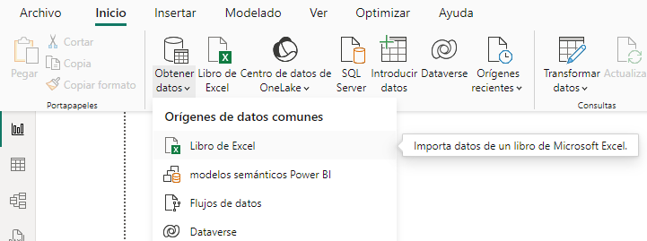

# Práctica 6.3. Cargar datos con Power BI.

## Objetivo de la práctica:

Al finalizar la práctica, serás capaz de:

- Cargar datos a Power BI Desktop.  
- Crear un gráfico en Power BI.

## Duración aproximada:

- 15 minutos.

## Escenario:

Imagina que estás a punto de jubilarte y estás considerando mudarte a un lugar con abundante sol, bajos índices de delincuencia y acceso a servicios médicos de alta calidad. O, tal vez eres un analista de datos que necesita esta información para ayudar a tus clientes a tomar decisiones estratégicas. Por ejemplo, podrías asistir a un distribuidor de gafas de sol a dirigir su promoción hacia las zonas donde el sol brilla con mayor frecuencia.

## Instrucciones:

Utilizar el archivo llamado: [Estados para la jubilación 2022](< Estados para la jubilación 2022.xlsx>).

### Tarea 1. Obtener datos.

**Paso 1.** Dentro de la máquina virtual encontrarás instalado el **Power BI Desktop**; por favor, inicia la aplicación.

**Paso 2.** Selecciona la pestaña **Inicio** de la cinta de opciones y luego selecciona _Obtener datos > Libro de Excel_.

### Tarea 2. Cargar datos.

**Paso 1.** Ahora que has seleccionado la opción de *Libro de Excel*, ya puedes realizar la carga de datos en Power BI Desktop. Para esto, aparecerá una ventana donde puedes observar las opciones que tienes para cargar los datos, **Datos** o **Sheet1**.

En este caso, lo recomendable es utilizar la opción de Tabla ‘Datos’ con el fin de evitar un proceso de depuración que puede requerir al importar desde la hoja de Excel. Observa que al seleccionar cualquiera de las dos opciones, podrás tener una vista previa de los datos.

Selecciona la tabla ‘Datos’ y luego haz clic en el botón amarillo que dice **Cargar**.

### Tarea 3. Analizar los datos con lo que dispones en la pestaña de datos.

**Paso 1.** Ya que has realizado la carga de datos, puedes analizar los datos en la pestaña de datos con el fin de hacer una primera impresión del tipo de datos, valores, categoría y formatos.

### Tarea 4. Crear un gráfico para el análisis de datos.

Ahora, en la pestaña de informe, puedes realizar un análisis rápido de los datos para visualizar el promedio de puntaje según las regiones de Estados Unidos. El gráfico más adecuado para este análisis es un gráfico de columnas apiladas.

**Paso 1.** Regresa a la vista de informe y selecciona el segundo ícono **"Gráfico de columnas apiladas"**.

**Paso 2.** Del panel de Datos que se encuentra en el costado derecho, selecciona los campos: 

- Puntuación General.  
- Región.

Da clic en la flecha hacia abajo que está en el elemento del Eje Y. Finalmente, selecciona **Promedio** en la lista que aparece.

### Resultado esperado:

