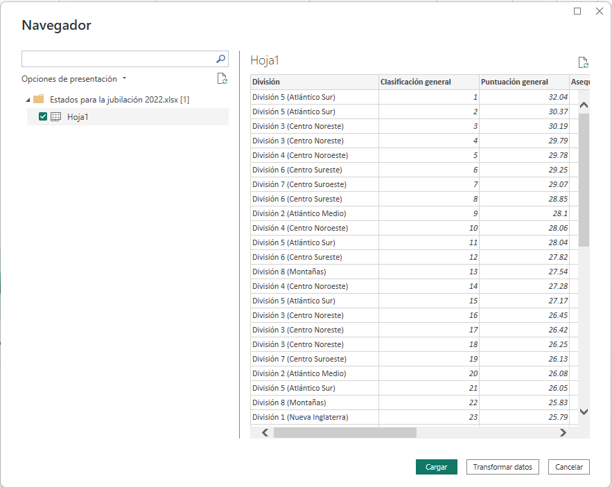
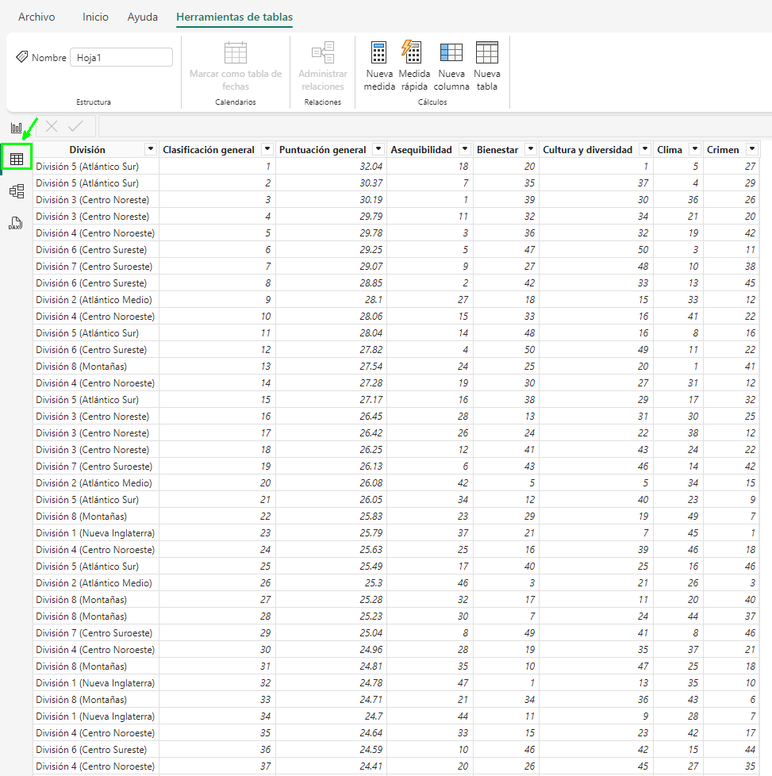
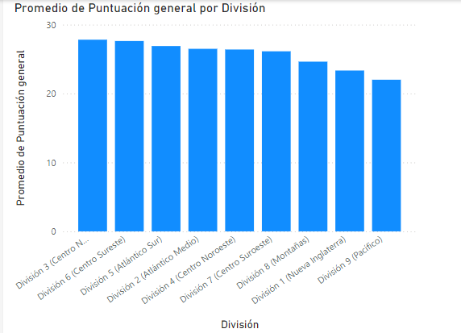

# Práctica 6.3. Cargar datos con Power BI.

## Objetivo de la práctica:
Al finalizar la práctica, serás capaz de:
- Cargar datos a Power BI Desktop y crear un gráfico en Power BI.

## Duración aproximada:
- 15 minutos.

## Escenario
Imagina que te encuentras al borde de la jubilación y estás considerando mudarte a un lugar con abundante sol, bajos índices de delincuencia y acceso a servicios médicos de alta calidad, o quizás eres un analista de datos y quieres esa información para ayudar a tus clientes. Por ejemplo, tal vez quieras ayudar a su distribuidor de gafas de sol a promocionar sus ventas en los lugares donde hace sol con más frecuencia.

## Instrucciones

Utilizar el archivo llamado [Estados para la jubilación 2022](< Estados para la jubilación 2022.xlsx>)

### Tarea 1. Obtener datos

Paso 1. Dentro de la máquina virtual encontrarás instalado el Power BI Desktop, por favor inicia la aplicación.

Paso 2. Selecciona la pestaña Inicio de la cinta de opciones y luego selecciona Obtener datos > Libro de Excel.

### Resultado esperado

### Tarea 2.  Cargar datos

Paso 1. Ahora que hemos seleccionado la opción de *Libro de Excel* ya podemos realizar la carga de datos en Power BI Desktop, aparecerá una ventana donde podemos ver las opciones que tenemos para cargar los datos, Datos o Sheet1.

En este caso lo recomendable es utilizar la opción de Tabla ‘Datos’ con el fin de evitar un proceso de depuración que puede requerir al importar desde la hoja de Excel. Observa que al seleccionar cualquiera de las dos opciones, podrás tener una vista previa de los datos.

Selecciona la tabla ‘Datos’ y luego da clic en el botón amarillo que dice Cargar.

### Tarea 3. Analiza los datos con lo que dispones en la pestaña de datos

Paso 1. Ya que hemos realizado la carga de datos podemos analizar los datos en la pestaña de datos con el fin de hacer una primera impresión del tipo de datos, valores, categoría y formatos.

### Tarea 4. Crea un gráfico para el análisis de datos.

Ahora en la pestaña de informe, podemos realizar un análisis rápido de los datos con el fin de ver el “El promedio de puntaje según las regiones de Estados Unidos”, el gráfico que puede utilizar es un gráfico de columnas apiladas.

Paso 1. Regresa a la vista de informe y selecciona el segundo icono "Gráfico de columnas apiladas".

Paso 2. Del panel de Datos que se encuentra en el costado derecho, selecciona los campos: 
- Puntuación General
- Región

Da clic en la flecha hacia abajo que está en el elemento del Eje Y.
Selecciona promedio en la lista que aparece.

### Resultado esperado

