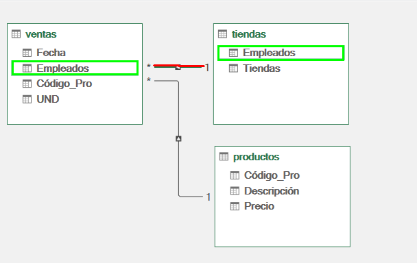

# Práctica 6.3. Trabajando con Power Pivot

## Objetivo de la práctica:

Al finalizar la práctica, serás capaz de:

- Comprender el proceso de agregar y relacionar múltiples tablas en Power Pivot para crear un modelo de datos integrado.
- Aprender a usar Power Pivot para crear una tabla dinámica basada en datos relacionados de múltiples tablas.

## Duración aproximada:

- 10 minutos.

## Escenario:

Eres un analista de datos en una empresa que maneja grandes volúmenes de información sobre ventas, productos y tiendas. Recientemente, has notado que el manejo de estos datos en hojas de Excel individuales resulta lento y complicado. Por ello, decide usar Power Pivot para integrar y relacionar estas tablas, permitiendo un análisis más fluido y eficiente.

### Tarea 1. Agregar tablas al modelo de datos

**Paso 1.** Descarga y guarda el siguiente archivo llamado: [PRACTICA POWER PIVOT ](<PRACTICA POWER PIVOT.xlsx>).

**Paso 2.** Dirígete a la pestaña _Ventas_, posteriormente en la barra superior selecciona _Power Pivot_ y selecciona _Agregar a modelo de datos_

Verás que se despliega el editor de Power Pivot

**Paso 3** 
minimizar la pantalla y hacer lo mismo con la pestaña de _Tiendas_ y _Productos

Veras en el editor de Power Pivot las tres pestañas de cada modelo de datos agregado.

### Tarea 2: Relacionar las tablas en Power Pivot

**Paso 1.** Ir a la vista de diagrama:
* En la ventana de Power Pivot, haz clic en Vista de diagrama.
* Aparecerán las tres tablas cargadas con sus encabezados visibles.

**Paso 2** Relacionar la tabla de Ventas con la de Productos:

* Identifica la columna Código de Producto en ambas tablas.
* Arrastra la columna Código de Producto de la tabla de Ventas hacia la columna correspondiente en la tabla de Productos.

_Nota_: Considera que puedes arrastrar las tablas según tu preferencia. 

* Verifica que la relación se haya creado.

 
**Paso 3** Relacionar la tabla de Ventas con la de Tiendas:

* Encuentra la columna Empleado en la tabla de Ventas y la columna Empleado en la tabla de Tiendas.
* Arrastra la columna Empleado de la tabla de Ventas hacia la columna en la tabla de Tiendas.

* Asegúrate de que la relación sea correcta.

### Tarea 3: Crear una tabla dinámica en Power Pivot

**Paso 1.** Insertar una tabla dinámica:

* En la ventana de Power Pivot y selecciona Tabla dinámica en la parte superior.

* Elige Nueva hoja de cálculo para que la tabla dinámica se inserte en una hoja nueva en Excel.

**Paso 2.** Agregar campos a la tabla dinámica:

* En la lista de campos de la tabla dinámica, selecciona Tienda de la tabla de Tiendas y colócala en el área de Filas.

* Agrega Descripción del Producto de la tabla de Productos al área de Filas debajo de Tienda.

* Añade Unidades de la tabla de Ventas al área de Valores.

### Resultado esperado:

## [Menú principal](../README.md)

## [Práctica 6.1. Consolidación de Ventas.](../Capítulo6/README_6.1.md)

## [Práctica 6.3. Cargar datos con Power BI.](../Capítulo6/README_6.3.md)
